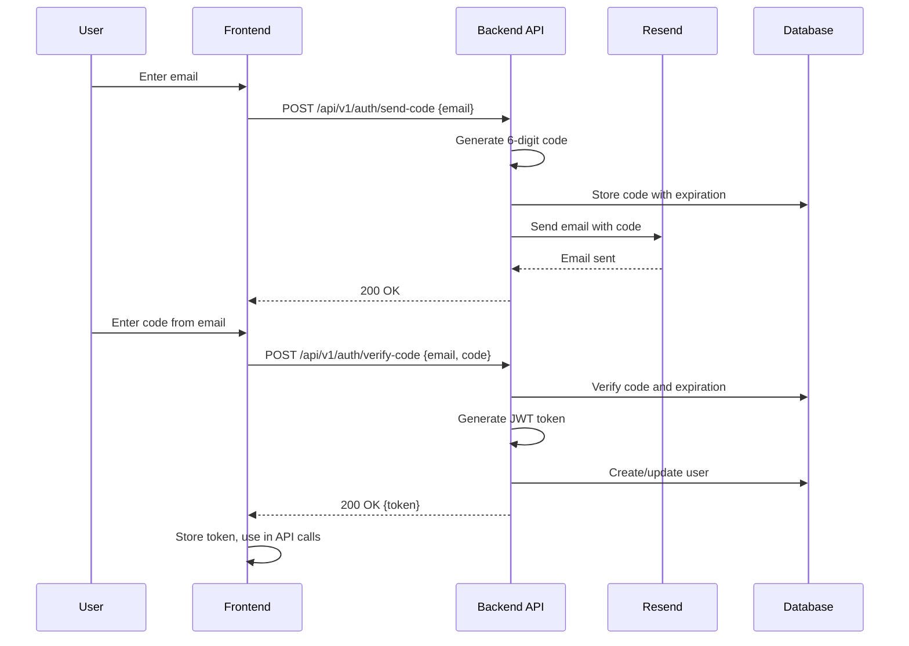

# Backend Architecture

Backend-specific architecture details for the FastAPI monolith. This section defines service organization, database access patterns, and authentication architecture.

## Service Architecture

### Controller/Route Organization

```
backend/
├── app/
│   ├── main.py                  # FastAPI application entry point
│   ├── routers/                 # API route handlers
│   │   ├── __init__.py
│   │   ├── health.py           # /health endpoint (unversioned)
│   │   └── v1/                  # API version 1 routes
│   │       ├── __init__.py
│   │       ├── documents.py     # /api/v1/documents/* endpoints
│   │       ├── translations.py  # /api/v1/translations/* endpoints
│   │       ├── languages.py     # /api/v1/languages endpoint
│   │       └── auth.py          # /api/v1/auth/* endpoints (post-MVP)
│   ├── services/                # Business logic modules
│   │   ├── __init__.py
│   │   ├── translation/         # Translation service module
│   │   │   ├── __init__.py
│   │   │   ├── translator.py   # OpenAI integration
│   │   │   ├── chunking.py      # Text chunking logic
│   │   │   └── progress.py      # Progress tracking
│   │   ├── persistence/         # Database operations
│   │   │   ├── __init__.py
│   │   │   ├── document_repository.py
│   │   │   ├── translation_repository.py
│   │   │   └── user_repository.py (post-MVP)
│   │   └── auth/                # Authentication service (post-MVP)
│   │       ├── __init__.py
│   │       ├── jwt_handler.py
│   │       └── email_service.py
│   ├── models/                  # SQLAlchemy models
│   │   ├── __init__.py
│   │   ├── document.py
│   │   ├── translation.py
│   │   └── user.py
│   ├── schemas/                 # Pydantic schemas
│   │   ├── __init__.py
│   │   ├── document.py
│   │   ├── translation.py
│   │   └── user.py
│   ├── database.py             # Database connection and session
│   ├── dependencies.py          # FastAPI dependencies
│   └── config.py               # Configuration management
├── alembic/                     # Database migrations
│   ├── versions/
│   └── env.py
└── tests/                       # Backend tests
    ├── test_routers/
    └── test_services/
```

### Controller Template

```python
# app/routers/v1/documents.py
from fastapi import APIRouter, Depends, UploadFile, File, Form, HTTPException
from sqlalchemy.ext.asyncio import AsyncSession
from app.database import get_db
from app.schemas.document import DocumentResponse, DocumentCreate
from app.services.persistence.document_repository import DocumentRepository
from app.dependencies import get_session_id

router = APIRouter(prefix="/api/v1/documents", tags=["documents"])

@router.post("/upload", response_model=DocumentResponse, status_code=201)
async def upload_document(
    file: UploadFile = File(...),
    source_language: str = Form(...),
    db: AsyncSession = Depends(get_db),
    session_id: str = Depends(get_session_id),
):
    # Validate file
    if not file.filename.endswith('.txt'):
        raise HTTPException(status_code=422, detail="File must be TXT format")
    
    content = await file.read()
    if len(content) > 10 * 1024 * 1024:  # 10MB
        raise HTTPException(status_code=413, detail="File too large (max 10MB)")
    
    # Create document
    repo = DocumentRepository(db)
    document = await repo.create_document(
        content=content.decode('utf-8'),
        file_name=file.filename,
        file_size=len(content),
        source_language=source_language,
        session_id=session_id,
    )
    
    return document

@router.get("/{document_id}", response_model=DocumentResponse)
async def get_document(
    document_id: str,
    db: AsyncSession = Depends(get_db),
    session_id: str = Depends(get_session_id),
):
    repo = DocumentRepository(db)
    document = await repo.get_document(document_id, session_id)
    if not document:
        raise HTTPException(status_code=404, detail="Document not found")
    return document
```

### Main Application Setup

```python
# app/main.py
from fastapi import FastAPI
from fastapi.middleware.cors import CORSMiddleware
from app.routers import health
from app.routers.v1 import documents, translations, languages

app = FastAPI(
    title="Librilabs Translator API",
    version="1.0.0",
    description="Document translation and review workflow API",
)

# CORS configuration
app.add_middleware(
    CORSMiddleware,
    allow_origins=["http://localhost:3000"],  # Frontend URL
    allow_credentials=True,
    allow_methods=["*"],
    allow_headers=["*"],
)

# Unversioned routes
app.include_router(health.router)

# Versioned routes (v1)
app.include_router(documents.router)
app.include_router(translations.router)
app.include_router(languages.router)

# Post-MVP: Add auth router
# app.include_router(auth.router)
```

## Database Architecture

### Schema Design

See [Database Schema](#database-schema) section for complete SQL schema definition.

### Data Access Layer

```python
# app/services/persistence/document_repository.py
from sqlalchemy.ext.asyncio import AsyncSession
from sqlalchemy import select
from app.models.document import Document
from typing import Optional
import uuid

class DocumentRepository:
    def __init__(self, db: AsyncSession):
        self.db = db
    
    async def create_document(
        self,
        content: str,
        file_name: str,
        file_size: int,
        source_language: str,
        session_id: str,
        user_id: Optional[uuid.UUID] = None,
    ) -> Document:
        document = Document(
            id=uuid.uuid4(),
            content=content,
            file_name=file_name,
            file_size=file_size,
            source_language=source_language,
            session_id=session_id,
            user_id=user_id,
        )
        self.db.add(document)
        await self.db.commit()
        await self.db.refresh(document)
        return document
    
    async def get_document(
        self,
        document_id: uuid.UUID,
        session_id: str,
    ) -> Optional[Document]:
        result = await self.db.execute(
            select(Document).where(
                Document.id == document_id,
                Document.session_id == session_id,
            )
        )
        return result.scalar_one_or_none()
```

## Authentication and Authorization

### Auth Flow (Post-MVP)



### Middleware/Guards

```python
# app/dependencies.py
from fastapi import Depends, HTTPException, Header
from typing import Optional
import jwt
from app.config import settings

async def get_session_id(
    x_session_id: Optional[str] = Header(None, alias="X-Session-Id")
) -> str:
    """Get session ID from header (MVP anonymous authentication)"""
    if not x_session_id:
        # Generate new session ID (should be done by frontend, but fallback)
        import uuid
        return str(uuid.uuid4())
    return x_session_id

# Post-MVP: JWT authentication
async def get_current_user(
    authorization: Optional[str] = Header(None)
) -> User:
    """Get current authenticated user from JWT token (post-MVP)"""
    if not authorization or not authorization.startswith("Bearer "):
        raise HTTPException(status_code=401, detail="Not authenticated")
    
    token = authorization.split(" ")[1]
    try:
        payload = jwt.decode(token, settings.JWT_SECRET, algorithms=["HS256"])
        user_id = payload.get("sub")
        # Get user from database
        # Return user
    except jwt.ExpiredSignatureError:
        raise HTTPException(status_code=401, detail="Token expired")
    except jwt.InvalidTokenError:
        raise HTTPException(status_code=401, detail="Invalid token")
```

**Rationale for Backend Architecture:**

**Design Decisions:**
1. **Modular Service Structure:** Services organized by domain (translation, persistence, auth) for clear separation of concerns
2. **Repository Pattern:** Data access abstracted through repository classes for testability and flexibility
3. **Async/Await:** Full async support with SQLAlchemy AsyncSession for concurrent request handling
4. **Pydantic Schemas:** Request/response validation and serialization using Pydantic
5. **Dependency Injection:** FastAPI dependencies for database sessions, authentication, and configuration
6. **Route Organization:** Routes organized by resource for maintainability

**Key Patterns:**
- **Service Layer:** Business logic separated from route handlers
- **Repository Pattern:** Database operations abstracted for testability
- **Dependency Injection:** FastAPI dependencies for reusable components
- **Error Handling:** Structured error responses with HTTP status codes
- **Session Management:** MVP uses session_id header, post-MVP adds JWT tokens

---
