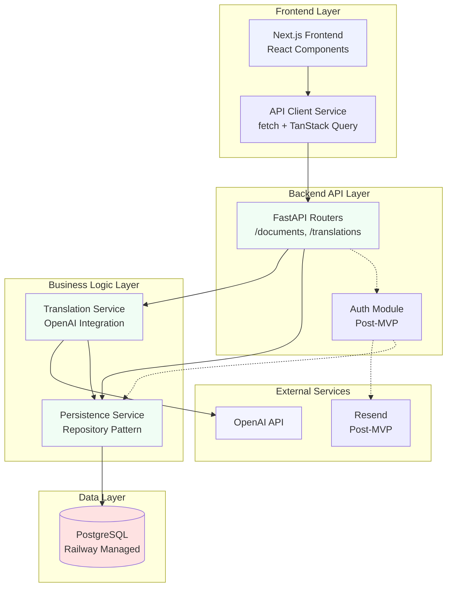

# Components

Major logical components/services across the fullstack, with clear boundaries and interfaces. Components are organized by responsibility and technology stack.

## Frontend Application

**Responsibility:** User interface for document upload, translation progress monitoring, side-by-side comparison, and in-place editing. Handles all user interactions and provides visual feedback throughout the translation workflow.

**Key Interfaces:**
- React component tree with Next.js routing
- API client service layer (fetch + TanStack Query)
- State management (TanStack Query for server state, useState/useReducer for UI state)
- File upload component with drag-and-drop
- Side-by-side comparison view with synchronized scrolling
- In-place text editor for translation editing

**Dependencies:**
- Backend API (REST endpoints)
- Browser APIs (FileReader, sessionStorage)
- Untitled UI component library
- TanStack Query for data fetching

**Technology Stack:** Next.js 16.0.4, React 19, TypeScript, Untitled UI, Tailwind CSS, TanStack Query, React Hook Form

## Backend API Service

**Responsibility:** RESTful API endpoints for document management, translation processing, and data persistence. Handles file uploads, translation orchestration, progress tracking, and data CRUD operations.

**Key Interfaces:**
- `/health` - Health check endpoint (unversioned)
- `/api/v1/documents/*` - Document upload and retrieval
- `/api/v1/translations/*` - Translation creation, status, and content management
- `/api/v1/languages` - Supported language list
- OpenAPI/Swagger documentation at `/docs`

**Dependencies:**
- Database service (PostgreSQL via SQLAlchemy)
- Translation service module
- OpenAI API (external)
- Session management (MVP: session_id, post-MVP: JWT)

**Technology Stack:** FastAPI (Python 3.14), SQLAlchemy 2.0, asyncpg, Pydantic for validation

## Translation Service Module

**Responsibility:** Core translation logic including OpenAI API integration, document chunking, progress tracking, and quality optimization. Designed as extractable module for future microservice separation.

**Key Interfaces:**
- `translate_document(document_id, source_language, target_language)` - Main translation function
- `chunk_text(content, chunk_size)` - Text chunking for long documents
- `track_progress(translation_id, progress_percentage)` - Progress updates
- `resume_translation(translation_id)` - Resume interrupted translations

**Dependencies:**
- OpenAI API client
- Database service (for progress persistence)
- Document service (for source content retrieval)

**Technology Stack:** Python 3.14, OpenAI Python SDK, asyncio for concurrent processing

**Design Note:** This module is part of the FastAPI monolith but designed with clear boundaries to allow extraction to a separate translation worker service if translation load requires it.

## Database Service

**Responsibility:** Data persistence layer using PostgreSQL. Handles all database operations through SQLAlchemy ORM with async support.

**Key Interfaces:**
- SQLAlchemy models (Document, Translation, User)
- Repository pattern for data access
- Alembic migrations for schema versioning
- Connection pooling and async operations

**Dependencies:**
- PostgreSQL database (Railway managed)
- SQLAlchemy 2.0 with asyncpg driver

**Technology Stack:** PostgreSQL, SQLAlchemy 2.0, asyncpg, Alembic

## Persistence Service Module

**Responsibility:** Database operations abstraction layer. Provides CRUD operations for documents, translations, and users. Implements repository pattern for testability and future flexibility.

**Key Interfaces:**
- `create_document(content, file_name, source_language, session_id)`
- `get_document(document_id, session_id)`
- `create_translation(document_id, target_language, session_id)`
- `update_translation(translation_id, translated_content, progress_percentage)`
- `get_translation(translation_id, session_id)`

**Dependencies:**
- Database service (SQLAlchemy models and sessions)
- Session validation (for MVP anonymous access)

**Technology Stack:** Python 3.14, SQLAlchemy 2.0, AsyncSession

## Authentication Service Module (Post-MVP)

**Responsibility:** User authentication and authorization. Handles email code/magic-link authentication via Resend, JWT token generation, and session management.

**Key Interfaces:**
- `send_auth_code(email)` - Send authentication code via Resend
- `verify_auth_code(email, code)` - Verify code and issue JWT
- `validate_jwt(token)` - Validate JWT token
- `get_current_user(token)` - Get authenticated user

**Dependencies:**
- Resend email service (external)
- Database service (User model)
- JWT library

**Technology Stack:** Python 3.14, Resend SDK, JWT library (python-jose), FastAPI security utilities

**Note:** This module is designed but not implemented during MVP. API and data models support future authentication integration.

## Component Diagrams

**Rationale for Components:**

**Design Decisions:**
1. **Frontend/Backend Separation:** Clear separation allows independent deployment and scaling
2. **Modular Backend Services:** Translation and Persistence services are separate modules within the monolith, enabling future extraction
3. **Repository Pattern:** Persistence service abstracts database operations, improving testability and flexibility
4. **Service Boundaries:** Each component has a single responsibility with well-defined interfaces
5. **External Service Isolation:** OpenAI and Resend integrations are isolated in dedicated service modules

**Component Interactions:**
- **Frontend → Backend:** REST API calls via fetch + TanStack Query
- **Backend → Translation Service:** Internal function calls (can become async job queue post-MVP)
- **Backend → Database:** SQLAlchemy ORM with async sessions
- **Translation Service → OpenAI:** HTTP API calls with retry logic
- **Auth Module → Resend:** HTTP API calls for email delivery (post-MVP)

**Trade-offs:**
- **Monolith vs. Microservices:** MVP uses monolith for simplicity, but modular design allows future extraction
- **Synchronous Translation:** Translation processing happens synchronously in API request. Can be moved to background jobs if performance requires it
- **Session Management:** MVP uses simple session_id, post-MVP adds JWT-based authentication

---
