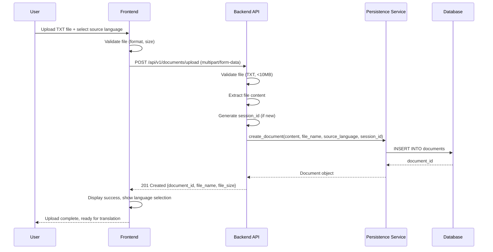
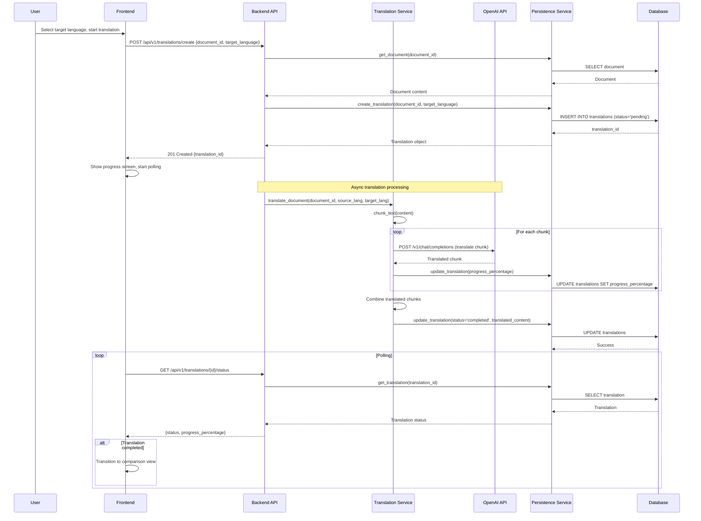
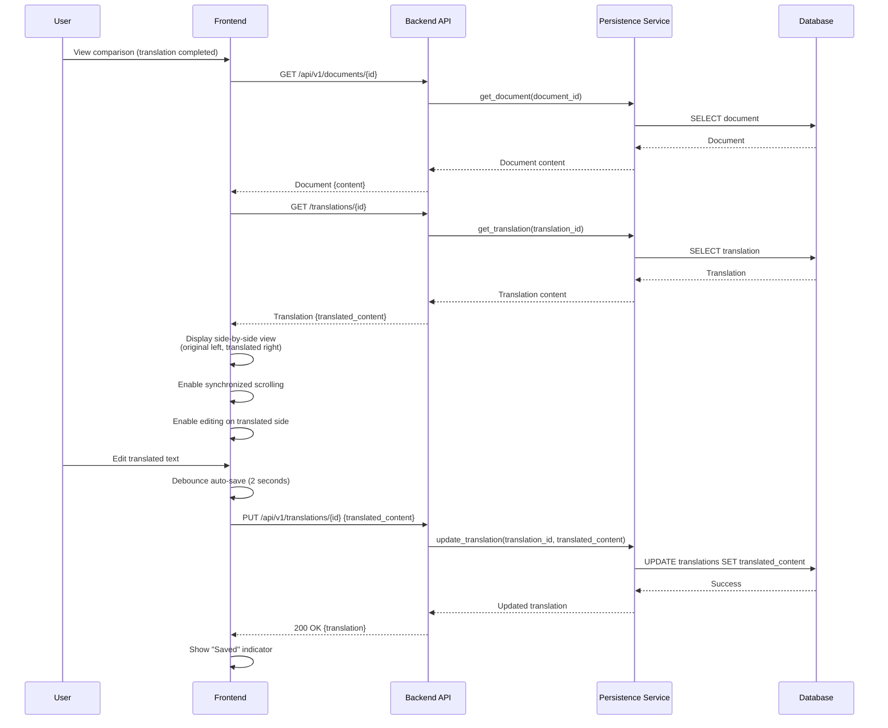
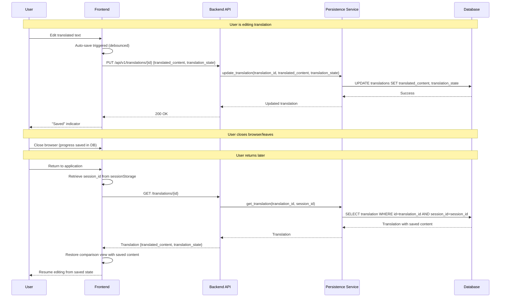
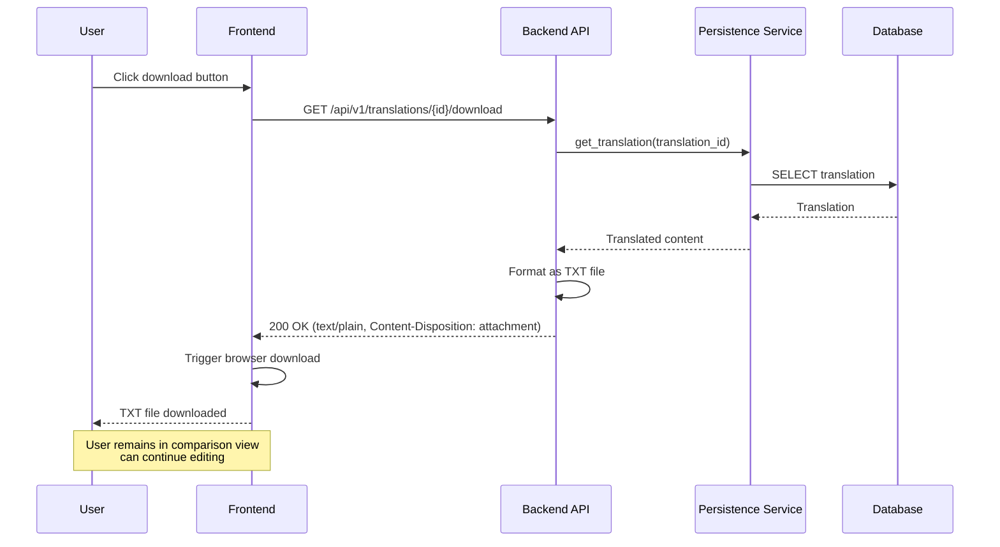

# Core Workflows

Key system workflows using sequence diagrams. These illustrate component interactions for critical user journeys from the PRD.

## Document Upload Workflow

## Translation Processing Workflow

## Side-by-Side Comparison and Editing Workflow

## Progress Saving and Resume Workflow

## Download/Export Workflow

**Rationale for Core Workflows:**

**Design Decisions:**
1. **Async Translation:** Translation processing is asynchronous to avoid blocking API requests. Frontend polls for status updates.
2. **Auto-Save with Debouncing:** Editing changes are auto-saved with 2-second debounce to reduce API calls while ensuring progress is saved.
3. **Session-Based Resume:** Progress is saved to database with session_id, allowing users to resume work across browser sessions.
4. **Non-Blocking Download:** Download doesn't interrupt the editing workflow - users can continue editing after download.
5. **Synchronized Scrolling:** Frontend handles scroll synchronization client-side for smooth UX.

**Workflow Characteristics:**
- **Upload:** Simple, synchronous workflow with immediate feedback
- **Translation:** Async processing with progress polling for long-running operations
- **Editing:** Real-time auto-save with debouncing for optimal UX and data safety
- **Resume:** Database-backed persistence enables seamless workflow continuation
- **Download:** Simple GET request that doesn't disrupt the editing experience

**Error Handling:**
- All workflows include error paths (network failures, validation errors, etc.)
- Frontend provides user-friendly error messages
- Backend returns structured error responses with codes and messages
- Failed operations can be retried by users

---
