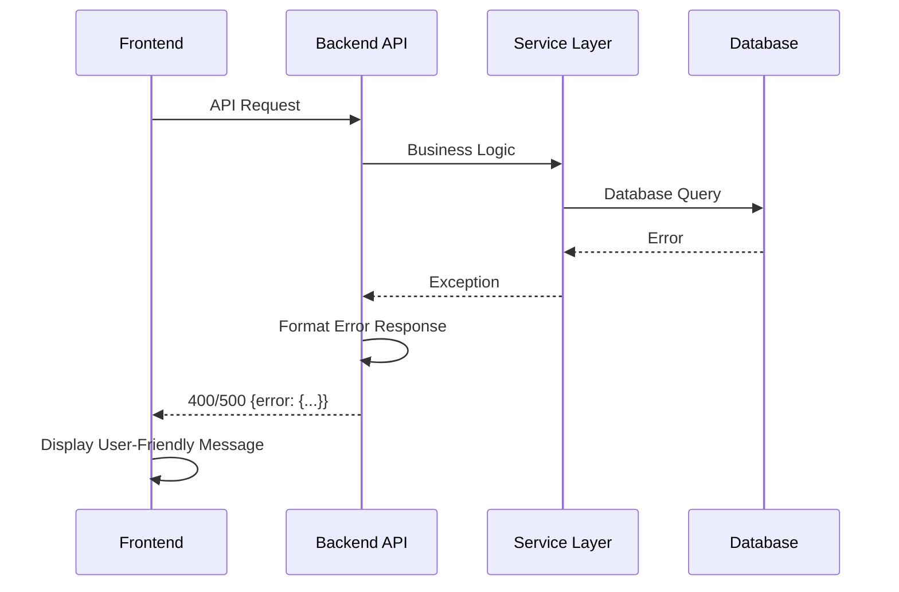

# Error Handling Strategy

Unified error handling across frontend and backend.

## Error Flow



## Error Response Format

```typescript
interface ApiError {
  error: {
    code: string;
    message: string;
    details?: Record<string, any>;
    timestamp: string;
    requestId: string;
  };
}
```

## Frontend Error Handling

```typescript
// lib/api/client.ts
export async function apiClient<T>(endpoint: string, options?: RequestInit): Promise<T> {
  try {
    const response = await fetch(`${API_BASE_URL}${endpoint}`, options);
    if (!response.ok) {
      const error = await response.json();
      throw new ApiError(error.error);
    }
    return response.json();
  } catch (error) {
    // Handle network errors, timeouts, etc.
    throw new ApiError({
      code: 'NETWORK_ERROR',
      message: 'Failed to connect to server',
    });
  }
}
```

## Backend Error Handling

```python
# app/main.py
from fastapi import FastAPI, Request
from fastapi.responses import JSONResponse
import uuid

app = FastAPI()

@app.exception_handler(Exception)
async def global_exception_handler(request: Request, exc: Exception):
    request_id = str(uuid.uuid4())
    return JSONResponse(
        status_code=500,
        content={
            "error": {
                "code": "INTERNAL_ERROR",
                "message": "An internal error occurred",
                "timestamp": datetime.utcnow().isoformat(),
                "request_id": request_id,
            }
        }
    )
```

---
