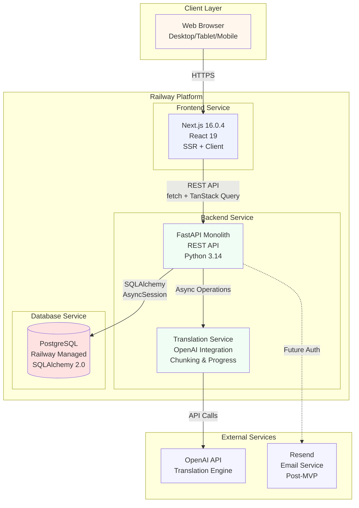

# High Level Architecture

## Technical Summary

Librilabs Translator uses a modern fullstack architecture combining Next.js 16.0.4 frontend and FastAPI (Python 3.14) backend in a monorepo structure. The frontend is a client-side React 19 application with selective server-side rendering, communicating with a monolithic FastAPI backend via RESTful APIs using native `fetch` and TanStack Query for state management. The backend uses a modular design with extractable service packages (`services.translation`, `services.auth`, `services.persistence`) that allow future microservices extraction if translation load requires it. PostgreSQL (Railway managed) serves as the primary data store, with document content stored directly in the database for MVP simplicity. The entire system is deployed on Railway using Docker containerization, enabling consistent deployments across dev, staging, and production environments. This architecture achieves PRD goals by providing a unified translation and review workflow, eliminating tool switching through integrated side-by-side comparison and in-place editing capabilities, while maintaining the flexibility to scale individual components as needed.

## Platform and Infrastructure Choice

**Platform:** Railway  
**Key Services:** 
- Railway Application Hosting (FastAPI backend + Next.js frontend)
- Railway Managed PostgreSQL (primary database)
- Railway Environment Variables & Secrets Management
- Railway GitHub Integration (CI/CD)

**Deployment Host and Regions:** Railway default regions (US-based primary, with global CDN for frontend assets)

**Rationale:**
Railway is the definitive platform choice for this project. It provides:
1. **Unified Platform:** Single platform for both frontend and backend hosting, plus managed PostgreSQL, reducing operational complexity
2. **Docker-First:** Native Docker support aligns with containerization requirements, enabling consistent local and production environments
3. **Developer Experience:** Simple deployment workflow with GitHub integration, reducing CI/CD setup overhead
4. **Cost Efficiency:** Predictable pricing suitable for MVP and early growth stages
5. **Managed Services:** Railway's managed PostgreSQL eliminates database administration overhead
6. **Environment Management:** Built-in support for dev/staging/production environments with environment variable management

**Railway-Specific Architecture Considerations:**
- **Frontend Deployment:** Next.js will be deployed as a Railway service, leveraging Railway's automatic HTTPS and global CDN
- **Backend Deployment:** FastAPI will run as a separate Railway service with automatic scaling based on traffic
- **Database:** Railway managed PostgreSQL provides automatic backups, connection pooling, and high availability
- **Service Communication:** Frontend and backend services communicate via Railway's internal networking (faster) or public URLs (for external access)
- **File Storage:** For MVP, TXT content stored in PostgreSQL. Post-MVP, Railway's volume storage or external S3-compatible service can be added if needed

## Repository Structure

**Structure:** Monorepo  
**Monorepo Tool:** npm workspaces (lightweight, no additional tooling needed)  
**Package Organization:**
```
librilabs-translator-v2/
├── frontend/          # Next.js application (independent package)
├── backend/           # FastAPI application (independent package)
├── packages/
│   └── shared/        # Shared TypeScript types/interfaces (if needed)
└── docs/              # Documentation directory
```

**Rationale:** The monorepo structure is already established in the project. npm workspaces provide sufficient functionality for managing two independent applications without the overhead of tools like Nx or Turborepo. Both frontend and backend remain independent and can be extracted to separate repositories if needed. The `packages/shared/` directory allows sharing TypeScript interfaces between frontend and backend when needed, maintaining type safety across the stack.

## High Level Architecture Diagram



## Architectural Patterns

- **Monolith with Modular Design:** Single FastAPI application with clearly separated service modules (`services.translation`, `services.auth`, `services.persistence`) - _Rationale:_ Simplifies MVP development and deployment on Railway while maintaining flexibility for future microservices extraction if translation load requires it. The modular structure allows extracting `services.translation` to a separate Railway service if needed.

- **Component-Based UI:** React functional components with TypeScript and Untitled UI component library exclusively - _Rationale:_ Maintainability, type safety, and design consistency across the frontend without custom component development. Untitled UI provides all necessary components, reducing maintenance burden.

- **Repository Pattern:** Abstract data access logic through SQLAlchemy 2.0 models and service layers - _Rationale:_ Enables testing, future database migration flexibility, and clean separation between business logic and data persistence. AsyncSession support aligns with FastAPI's async nature.

- **RESTful API Design:** Standard REST endpoints organized by resource (`/documents/*`, `/translations/*`, `/auth/*`, `/users/*`) - _Rationale:_ Familiar pattern, easy to document with OpenAPI/Swagger (FastAPI built-in), straightforward frontend integration with native `fetch`.

- **Server State Management:** TanStack Query for API data caching and state management - _Rationale:_ Handles loading/error states, retries, and caching automatically, reducing boilerplate and improving UX. Particularly important for long-running translation operations.

- **Progressive Enhancement:** Next.js SSR where beneficial (initial page loads), client-side rendering for interactive features (side-by-side comparison) - _Rationale:_ Balances initial load performance with rich interactivity for the side-by-side comparison view. Railway's CDN optimizes static asset delivery.

- **Session-Based State Management (MVP):** Anonymous session management for documents and translations - _Rationale:_ MVP doesn't require authentication, but data model supports future user_id integration. This pattern allows seamless addition of authentication post-MVP without refactoring.

---
