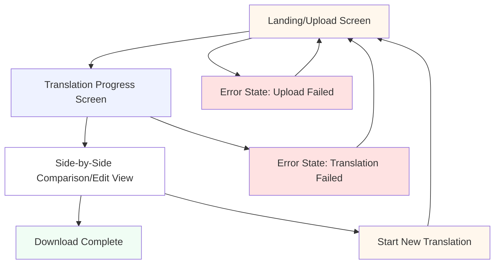
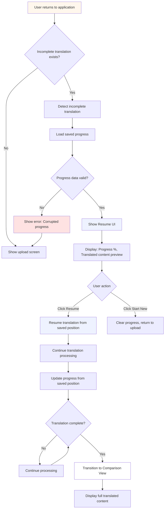
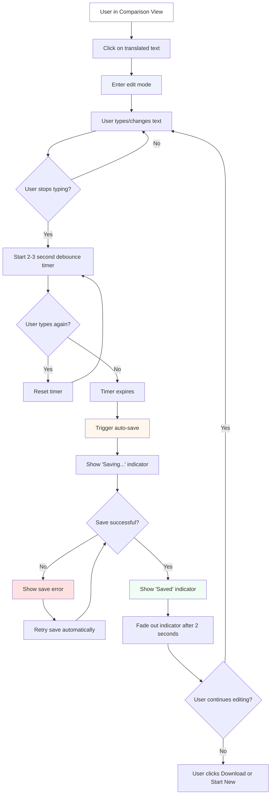
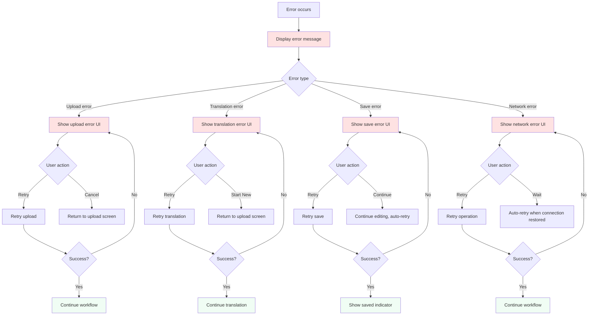

# Librilabs Translator UI/UX Specification

**Version:** 1.0  
**Date:** 2025-01-27  
**Author:** Sally (UX Expert)  
**Status:** Draft

---

## Introduction

This document defines the user experience goals, information architecture, user flows, and visual design specifications for Librilabs Translator's user interface. It serves as the foundation for visual design and frontend development, ensuring a cohesive and user-centered experience.

The specification is based on the Product Requirements Document (PRD) and Project Brief, which establish Librilabs Translator as a document translation software that combines AI-powered translation quality with an integrated human review workflow. The MVP focuses on TXT file translation with side-by-side comparison, in-place editing, and progress saving—specifically designed for individual academics, researchers, and writers translating longform documents.

**Key Context from PRD:**
- **Problem:** Users face a fragmented workflow requiring multiple tools (translate → export → review → edit → re-import)
- **Solution:** Integrated web application combining AI translation with built-in review/editing workflow
- **Target Users:** Individual academics/researchers (primary), writers (secondary), SMBs (tertiary)
- **Core Workflow:** Upload → Translate → Compare → Edit → Download
- **Technical Stack:** Next.js 16.0.4, Untitled UI components, Tailwind CSS, TanStack Query

### Change Log

| Date | Version | Description | Author |
|------|---------|-------------|--------|
| 2025-01-27 | v1.0 | Initial UI/UX specification creation | Sally (UX Expert) |

---

## Overall UX Goals & Principles

### Target User Personas

Based on the PRD, we have three primary user segments:

**1. Primary Persona: Academic Researcher**
- **Demographic:** University professors, graduate students, postdoctoral researchers, independent researchers (ages 30-50, advanced degrees)
- **Context:** Regularly translates research papers, academic articles, and scholarly content for publication or collaboration
- **Key Needs:** 
  - Publication-ready translations with accurate terminology
  - Efficient workflow to save time (currently spends 2-4 hours on 10-page documents)
  - Confidence in translation quality for academic work
  - Preservation of citation formatting and academic style
- **Pain Points:** Current tools lack integrated review workflow, must export to external editors, no side-by-side comparison
- **Goals:** Publish research in multiple languages, collaborate internationally, maintain academic quality

**2. Secondary Persona: Professional Writer/Content Creator**
- **Demographic:** Authors, bloggers, journalists, technical writers, independent content creators (ages 25-60, varied education)
- **Context:** Translates longform content (articles, books, blog posts) for global audiences
- **Key Needs:**
  - Preservation of writing voice and style in translation
  - Cost-effective solution (can't afford ongoing professional services)
  - Efficient workflow for regular translation needs
  - Creative control over translation style and tone
- **Pain Points:** Need to preserve writing style, current tools don't support review workflow, professional services too expensive
- **Goals:** Reach global audiences, maintain creative voice, reduce translation costs, build international readership

**3. Tertiary Persona: Small Business Team Member**
- **Demographic:** Small business teams (2-10 employees) in professional services, consulting, tech startups
- **Context:** Translates business documents (proposals, contracts, marketing materials, client communications)
- **Key Needs:**
  - Professional quality translations without enterprise complexity
  - Affordable solution (enterprise TMS platforms too expensive at $10K+/year)
  - Simple workflow for small team needs
  - Document translation focus (not web/app localization)
- **Pain Points:** Enterprise platforms too expensive and complex, free tools lack workflow and quality
- **Goals:** Serve international clients, expand business globally, maintain professional quality, control costs

### Usability Goals

**1. Ease of Learning**
- **Goal:** New users can complete their first translation workflow (upload → translate → review → download) within 5 minutes without external guidance
- **Rationale:** MVP success criteria requires 40%+ user activation within 7 days. Fast onboarding is critical for individual users who may not have time for extensive tutorials
- **Measurement:** Time-to-first-translation <5 minutes (per PRD KPI)

**2. Efficiency of Use**
- **Goal:** Power users (academics/researchers translating regularly) can complete frequent translation tasks with minimal clicks and cognitive load
- **Rationale:** Target users currently spend 2-4 hours on 10-page documents. Goal is 30%+ time reduction through integrated workflow
- **Measurement:** User-reported time savings vs. previous workflow (target: 30%+ reduction)

**3. Error Prevention**
- **Goal:** Clear validation and confirmation for destructive actions (e.g., starting new translation before saving current work)
- **Rationale:** Users are working with important documents (research papers, business documents). Data loss would be catastrophic
- **Measurement:** Zero critical bugs (data loss) in production for 30 days (per NFR4)

**4. Memorability**
- **Goal:** Infrequent users can return to the application after weeks/months and remember how to use core features without relearning
- **Rationale:** Users may translate documents sporadically (monthly or quarterly). Interface should be intuitive enough to remember
- **Measurement:** 70%+ of users who translate 2+ documents within 30 days (per PRD user success metric)

**5. Workflow Integration**
- **Goal:** 80%+ of users complete full workflow (upload → translate → compare → edit → download) without using external tools
- **Rationale:** Core value proposition is eliminating fragmented workflow. Success means users don't need to export to Word/Google Docs
- **Measurement:** Core workflow completion rate (target: 80%+, per NFR14)

**6. Performance Perception**
- **Goal:** Interface feels fast and responsive even during long translation processing (up to 5 minutes for 50-page documents)
- **Rationale:** Translation processing is inherently slow (OpenAI API calls). UI must provide clear feedback to maintain user confidence
- **Measurement:** User satisfaction with translation progress UI, perceived responsiveness

### Design Principles

1. **Clarity over Cleverness** - Prioritize clear communication and intuitive patterns over aesthetic innovation. Use familiar UI patterns (side-by-side comparison, standard file upload) that users already understand. Avoid reinventing common interactions.

2. **Progressive Disclosure** - Reveal features as needed: upload interface first, then translation progress, then comparison view. Don't overwhelm users with all features upfront. MVP scope is intentionally minimal—embrace simplicity.

3. **Document-First Experience** - The document content is the hero. UI elements should support the document, not compete with it. Side-by-side comparison view is the core interaction—everything else should fade into the background.

4. **Immediate Feedback** - Every user action (upload, translation start, editing, save) must have clear, immediate visual feedback. Users need confidence that the system is working, especially during long translation processes.

5. **Accessible by Default** - Design for all users from the start. WCAG AA compliance is non-negotiable. Keyboard navigation, screen reader support, and sufficient color contrast are requirements, not nice-to-haves.

6. **Context Preservation** - Maintain document context throughout the workflow. Users should always know where they are (upload → translating → comparing/editing). Clear progress indicators and navigation prevent disorientation.

7. **Error Recovery** - Design for failure. Translation can fail, network can disconnect, files can be invalid. Provide clear error messages and recovery paths. Never leave users stuck or confused about what went wrong.

---

## Information Architecture (IA)

### Site Map / Screen Inventory

The MVP follows a linear, workflow-driven architecture optimized for single-document translation. The structure is intentionally minimal to support the core value proposition: eliminating tool switching.



**Screen Descriptions:**

1. **Landing/Upload Screen** (Entry Point)
   - Primary action: File upload (drag-and-drop or file picker)
   - Language selection: Source and target language dropdowns
   - File validation feedback: Format and size validation
   - Error states: Invalid file format, file too large, network errors
   - **MVP Note:** No document history/list view. Users land directly on upload screen.

2. **Translation Progress Screen** (Intermediate State)
   - Progress indicator: Progress bar or percentage
   - Time estimate: "Estimated time: X minutes remaining"
   - Status message: "Translating your document..."
   - Auto-transition: Automatically transitions to comparison view when complete (per FR13)
   - Error state: Translation failure with retry option

3. **Side-by-Side Comparison/Edit View** (Primary Working Interface)
   - Left column: Original text (read-only)
   - Right column: Translated text (editable)
   - Synchronized scrolling: Both columns scroll together
   - Paragraph markers: Visual indicators for paragraph boundaries
   - Editing controls: In-place editing with auto-save
   - Download button: Integrated in header/toolbar
   - Save status indicator: Shows "Saving...", "Saved", or error state
   - **MVP Note:** After download, users remain in this view to continue editing if needed.

4. **Error States** (Throughout Workflow)
   - Upload errors: Invalid format, file too large, network failure
   - Translation errors: API failure, timeout, processing error
   - Edit/save errors: Network failure, save conflict
   - All error states provide clear messages and recovery paths

**Key Architectural Decisions:**
- **Linear Flow:** No complex navigation—users follow a clear path: Upload → Translate → Compare/Edit → Download
- **Single Document Focus:** MVP intentionally omits document history/list view to maintain simplicity
- **State-Driven UI:** Interface transforms based on workflow state (upload → progress → comparison)
- **Error Recovery:** Each screen has error states with clear recovery paths

### Navigation Structure

**Primary Navigation:**
- **Persistent Header Bar** (present on all screens at all times)
  - **Logo/Brand:** "Librilabs" text logo (left side)
  - **Action Button:** "Start New Translation" (right side, visible in comparison view)
  - **Download Button:** Visible in comparison view only (header/toolbar area)
  - **Purpose:** Provides consistent brand identity and primary workflow actions. Header remains visible throughout entire workflow for context and navigation.

**Secondary Navigation:**
- **None for MVP** - The linear workflow eliminates the need for secondary navigation. Users progress through states rather than navigating between sections.

**Breadcrumb Strategy:**
- **State Indicators** (not traditional breadcrumbs)
  - Visual progress indicators show current workflow stage
  - Upload screen: Shows "Step 1 of 3: Upload Document"
  - Progress screen: Shows "Step 2 of 3: Translating..."
  - Comparison view: Shows "Step 3 of 3: Review & Edit"
  - **Rationale:** Breadcrumbs are unnecessary for linear workflow, but state indicators help users understand progress

**Navigation Patterns:**
- **Forward Navigation:** Automatic progression (upload → progress → comparison)
- **Backward Navigation:** "Start New Translation" button returns to upload screen (clears current document)
- **No Cancel Translation:** Users cannot cancel translation once started (must wait for completion or failure)
- **No Deep Linking:** MVP doesn't support deep links to specific documents (post-MVP feature)
- **No History:** No back/forward browser navigation between workflow states (intentional—prevents confusion)

**User Mental Model:**
- Users think in terms of **workflow stages**, not **pages**
- Navigation should feel like **progressing through a process**, not **browsing a website**
- Each stage reveals the next step naturally (progressive disclosure)

---

## User Flows

### Flow 1: Main Translation Workflow (Happy Path)

**User Goal:** Translate a document from source language to target language, review the translation, make edits, and download the final result.

**Entry Points:**
- User lands on upload screen (initial entry)
- User clicks "Start New Translation" from comparison view (new translation)

**Success Criteria:**
- User successfully uploads a valid TXT file
- Translation completes successfully
- User can review translation side-by-side with original
- User can edit translated text
- User can download final translated text as TXT file
- All edits are automatically saved

**Flow Diagram:**

```mermaid
graph TD
    A[User lands on Upload Screen] --> B{Select file}
    B --> C{File valid?}
    C -->|No| D[Show error: Invalid format/size]
    D --> B
    C -->|Yes| E[File uploaded successfully]
    E --> F[Select source language]
    F --> G[Select target language]
    G --> H{Source ≠ Target?}
    H -->|No| I[Show error: Same language]
    I --> F
    H -->|Yes| J[Click 'Translate' button]
    J --> K[Transition to Progress Screen]
    K --> L[Show progress bar + time estimate]
    L --> M{Translation complete?}
    M -->|No| N[Update progress + time estimate]
    N --> M
    M -->|Yes| O[Auto-transition to Comparison View]
    O --> P[Display side-by-side: Original | Translated]
    P --> Q{User action}
    Q -->|Edit text| R[Edit translated text in place]
    R --> S[Auto-save triggered]
    S --> T{Save successful?}
    T -->|No| U[Show save error, retry]
    U --> S
    T -->|Yes| V[Show 'Saved' indicator]
    V --> Q
    Q -->|Click Download| W[Download TXT file]
    W --> X[File downloaded]
    X --> Y{Continue editing?}
    Y -->|Yes| Q
    Y -->|No| Z[Click 'Start New Translation']
    Z --> A
    
    style A fill:#FFF7ED
    style K fill:#EEF2FF
    style O fill:#FFFFFF
    style W fill:#F0FDF4
    style D fill:#FEE2E2
    style I fill:#FEE2E2
    style U fill:#FEE2E2
```

**Edge Cases & Error Handling:**

- **Invalid File Format:** User uploads non-TXT file
  - **Error Message:** "Please upload a .txt file. Other formats coming soon."
  - **Recovery:** User can select a different file or convert their file to TXT

- **File Too Large:** User uploads file exceeding 10MB limit
  - **Error Message:** "File size exceeds 10MB limit. Please use a smaller file or split your document."
  - **Recovery:** User must reduce file size or split document

- **Same Language Selected:** User selects same language for source and target
  - **Error Message:** "Source and target languages must be different. Please select different languages."
  - **Recovery:** User can change either source or target language

- **Translation Failure:** Translation API fails or times out
  - **Error Message:** "Translation failed. Please try again or contact support if the problem persists."
  - **Recovery:** User can retry translation or return to upload screen

- **Network Error During Save:** Auto-save fails due to network issue
  - **Error Message:** "Failed to save changes. Retrying..." (with retry indicator)
  - **Recovery:** System automatically retries. If persistent, show manual retry option

- **Browser Refresh During Translation:** User refreshes page while translation in progress
  - **Behavior:** System detects incomplete translation, shows option to resume
  - **Recovery:** User can resume translation from saved progress (see Flow 3)

**Notes:**
- All transitions are automatic (no manual "Next" buttons)
- Progress screen auto-transitions to comparison view when complete (per FR13)
- Auto-save triggers after 2-3 second debounce period (per Story 3.2)
- Download button remains accessible after download (user can continue editing)

---

### Flow 2: Resume Interrupted Translation

**User Goal:** Resume a translation that was interrupted (browser closed, network failure, or user navigated away).

**Entry Points:**
- User returns to application after closing browser during translation
- User refreshes page during translation
- Translation failed but progress was saved

**Success Criteria:**
- System detects incomplete translation
- User can see saved progress (percentage, translated content so far)
- User can resume translation from last saved position
- Translation continues seamlessly from where it left off
- Resume operation has 90%+ success rate (per NFR3)

**Flow Diagram:**



**Edge Cases & Error Handling:**

- **Corrupted Progress Data:** Saved progress data is invalid or corrupted
  - **Error Message:** "Unable to resume translation. Progress data may be corrupted. Please start a new translation."
  - **Recovery:** User must start new translation (progress is lost)

- **Progress Data Missing:** Translation record exists but progress data is missing
  - **Error Message:** "Translation progress not found. Starting new translation."
  - **Recovery:** System treats as new translation (user must re-upload)

- **Resume Fails:** Resume operation fails after multiple attempts
  - **Error Message:** "Failed to resume translation. Please start a new translation."
  - **Recovery:** User can start new translation or contact support

- **Translation Already Complete:** User attempts to resume but translation actually completed
  - **Behavior:** System detects completion, automatically shows comparison view
  - **Recovery:** No action needed—user proceeds to comparison view

**Notes:**
- Resume functionality is critical for long documents (>10 pages) per NFR3
- Progress saving happens incrementally during translation (per Story 3.3)
- Resume UI should clearly show what was translated and what remains
- 90%+ success rate requirement means robust error handling is essential

---

### Flow 3: Edit and Auto-Save

**User Goal:** Edit translated text directly in the comparison view with automatic saving of changes.

**Entry Points:**
- User is in comparison view after translation completes
- User returns to comparison view after download
- User resumes editing after browser refresh

**Success Criteria:**
- User can click and edit translated text in place
- Changes are automatically saved after debounce period
- Save status is clearly indicated (saving, saved, error)
- Edited content persists across browser sessions
- Original text remains read-only

**Flow Diagram:**



**Edge Cases & Error Handling:**

- **Rapid Typing:** User types very quickly, triggering multiple save attempts
  - **Behavior:** Debounce timer prevents excessive saves. Only saves after user pauses typing
  - **Optimization:** Single save operation per debounce period

- **Network Disconnection:** Network fails during save
  - **Error Message:** "Failed to save. Retrying..." (with retry indicator)
  - **Recovery:** System automatically retries. If persistent, show manual retry button

- **Concurrent Edits:** Multiple browser tabs editing same translation (edge case)
  - **Behavior:** Last save wins (MVP doesn't support concurrent editing)
  - **Future:** Post-MVP could implement conflict resolution

- **Very Long Edits:** User makes extensive changes to large document
  - **Behavior:** Save happens incrementally. Large edits may take longer to save
  - **Feedback:** Show progress indicator for large saves

- **Browser Refresh During Edit:** User refreshes page while editing
  - **Behavior:** System loads last saved version (not unsaved changes)
  - **Warning:** Consider showing warning if unsaved changes exist (post-MVP enhancement)

- **Save Timeout:** Save operation times out
  - **Error Message:** "Save timed out. Please try again."
  - **Recovery:** User can manually retry save or continue editing (system will retry)

**Notes:**
- Auto-save debounce period: 2-3 seconds (per Story 3.2 acceptance criteria)
- Save status indicator should be unobtrusive but visible
- Edited content must persist across browser sessions (per Story 3.7)
- Original text column remains read-only (per FR8)

---

### Flow 4: Error Recovery and Retry

**User Goal:** Recover from errors and retry failed operations without losing progress.

**Entry Points:**
- Any error state in the application
- Translation failure
- Upload failure
- Save failure
- Network errors

**Success Criteria:**
- User understands what went wrong (clear error message)
- User knows how to recover (clear recovery path)
- User can retry failed operations
- User doesn't lose progress unnecessarily
- Error messages are accessible (screen reader compatible)

**Flow Diagram:**



**Edge Cases & Error Handling:**

- **Persistent Errors:** Error persists after multiple retries
  - **Behavior:** Show clear message that retry failed, provide alternative actions
  - **Recovery:** User can contact support, start new translation, or wait and retry later

- **Partial Progress Loss:** Error occurs but some progress is saved
  - **Behavior:** System attempts to preserve saved progress, offer resume option
  - **Recovery:** User can resume from last saved point if possible

- **Multiple Concurrent Errors:** Multiple errors occur simultaneously
  - **Behavior:** Prioritize most critical error, show others in sequence
  - **Recovery:** Address errors one at a time, clear recovery path for each

- **Error Message Accessibility:** Error messages must be accessible
  - **Requirements:** Screen reader compatible, sufficient color contrast, clear language
  - **Implementation:** Use ARIA labels, error announcements, accessible error components

**Notes:**
- All error messages must be user-friendly (per NFR12)
- Error recovery should preserve user progress when possible
- Retry mechanisms should be automatic when appropriate (network errors)
- Error states should never leave users stuck without recovery options

---

## Wireframes & Mockups

### Design Files

**Primary Design Tool:** Figma (recommended) or Sketch

**Design File Structure:**
- **Main Design File:** `librilabs-translator-ui-design.fig` (or `.sketch`)
- **Component Library:** Shared component library within design file
- **Design System:** Untitled UI components as base, customized with brand colors/typography

**Design File Organization:**
- **Frames/Screens:** Organized by workflow stage (Upload, Progress, Comparison)
- **Components:** Reusable Untitled UI components with brand customizations
- **States:** Variants for different states (default, hover, active, error, loading)
- **Responsive Breakpoints:** Desktop (default), Tablet, Mobile (post-MVP)

**Design Handoff:**
- **Developer Access:** Design files should be accessible to frontend developers
- **Specifications:** Use Figma's inspect mode or equivalent for spacing, colors, typography
- **Assets Export:** Export icons, images, and custom graphics as needed
- **Component Mapping:** Map design components to Untitled UI components

**Note:** Detailed visual designs (high-fidelity mockups) should be created in the design tool. This specification provides the foundation and requirements, but final visual design decisions (exact spacing, visual hierarchy refinements, micro-interactions) will be made during the design phase.

---

### Key Screen Layouts

#### Screen 1: Upload Screen

**Purpose:** Allow users to upload TXT files and select source/target languages before translation begins.

**Key Elements:**
- **Persistent Header:** Logo on left, minimal design
- **State Indicator:** "Step 1 of 3: Upload Document" (top center or below header)
- **File Upload Area:** Large drag-and-drop zone with upload icon/illustration
  - Text: "Drag and drop your .txt file here" or "Click to upload"
  - File format guidance: "Supported: .txt files up to 10MB"
- **File Input:** Hidden file input (triggered by click or drag-and-drop)
- **Language Selection:** Two dropdown selectors side-by-side
  - Left: "Source Language" dropdown (English, Spanish, French)
  - Right: "Target Language" dropdown (English, Spanish, French)
  - Validation: Disable "Translate" button if same language selected
- **Translate Button:** Primary action button (disabled until file uploaded and languages selected)
- **Error States:** Inline error messages below relevant fields
  - File format error: Below upload area
  - File size error: Below upload area
  - Language selection error: Below language dropdowns

**Layout Structure:**
```
┌─────────────────────────────────────────┐
│ [Logo]                    [Start New]   │ ← Header (persistent)
├─────────────────────────────────────────┤
│         Step 1 of 3: Upload Document     │ ← State indicator
│                                           │
│         ┌─────────────────────┐         │
│         │                     │         │
│         │   Drag & Drop Zone  │         │ ← Upload area
│         │   (or click to      │         │
│         │    upload)          │         │
│         │                     │         │
│         └─────────────────────┘         │
│                                           │
│    [Source Language ▼] [Target Language ▼] │ ← Language selection
│                                           │
│              [Translate]                 │ ← Primary action
└─────────────────────────────────────────┘
```

**Interaction Notes:**
- **Drag-and-Drop:** Visual feedback when file is dragged over drop zone (highlight, border change)
- **File Selection:** Show selected file name and size after upload
- **Language Selection:** Dropdowns use Untitled UI Select component
- **Validation:** Real-time validation feedback (disable button, show errors)
- **Accessibility:** Keyboard navigation, screen reader labels, focus indicators

**Design File Reference:** `Figma Frame: Upload Screen` (or equivalent in design tool)

---

#### Screen 2: Translation Progress Screen

**Purpose:** Show real-time translation progress with time estimates during document processing.

**Key Elements:**
- **Persistent Header:** Logo on left (no action buttons during progress)
- **State Indicator:** "Step 2 of 3: Translating..." (top center or below header)
- **Progress Container:** Centered content area
  - **Progress Bar:** Visual progress indicator (percentage-based)
  - **Percentage Display:** Large, prominent percentage (e.g., "45%")
  - **Status Message:** "Translating your document..."
  - **Loading Indicator:** Subtle animation (spinner or progress bar animation)
- **Background:** Subtle background pattern or color to indicate processing state

**Layout Structure:**
```
┌─────────────────────────────────────────┐
│ [Logo]                                  │ ← Header (persistent)
├─────────────────────────────────────────┤
│         Step 2 of 3: Translating...     │ ← State indicator
│                                           │
│                                           │
│              ┌─────────────┐            │
│              │             │            │
│              │    45%      │            │ ← Percentage
│              │             │            │
│              │ ████████░░░ │            │ ← Progress bar
│              │             │            │
│              │ Translating │            │ ← Status message
│              │ your        │            │
│              │ document... │            │
│              │             │            │
│              └─────────────┘            │
│                                           │
└─────────────────────────────────────────┘
```

**Interaction Notes:**
- **Auto-Update:** Progress updates automatically via polling (TanStack Query)
- **Smooth Animation:** Progress bar animates smoothly as percentage increases
- **No User Actions:** Users cannot interact during progress (no cancel button per requirements)
- **Auto-Transition:** Automatically transitions to comparison view when complete (no manual "Next" button)
- **Error State:** If translation fails, show error message with retry option

**Design File Reference:** `Figma Frame: Translation Progress Screen`

**Detailed Layout Specifications:**
- **Header Height:** 64px (persistent across all screens)
- **Header Padding:** 16px horizontal padding, logo on left
- **State Indicator:** 16px below header, centered, 14px font size (md), #6B7280 color (secondary text), 24px margin-bottom
- **Progress Container:** Centered vertically and horizontally, max-width 600px, 32px padding
- **Percentage Display:** 48px font size (display), semibold (600), #111827 color (primary text), centered above progress bar, 24px margin-bottom
- **Progress Bar:** 8px height, 100% width of container, rounded corners (4px), #E5E7EB background (light border), #F97316 fill (orange accent), 16px margin-bottom
- **Status Message:** 16px font size (lg), regular weight (400), #6B7280 color (secondary text), centered below progress bar, 16px margin-top
- **Loading Animation:** Subtle pulse animation on progress bar fill (opacity 0.8 to 1.0, 1.5s duration, infinite loop)
- **Spacing:** 24px vertical spacing between percentage, progress bar, and status message

---

#### Screen 3: Side-by-Side Comparison/Edit View

**Purpose:** Primary working interface displaying original and translated text side-by-side with editing capabilities.

**Key Elements:**
- **Persistent Header:** Logo on left, "Download" button and "Start New Translation" button on right
- **State Indicator:** "Step 3 of 3: Review & Edit" (top center or below header)
- **Save Status Indicator:** Small indicator in header showing "Saving...", "Saved", or error state
- **Two-Column Layout:** Equal-width columns with divider
  - **Left Column:** Original text (read-only)
    - Header: "Original Text" with source language label
    - Content: Scrollable text area with paragraph markers
    - Styling: Subtle background color to distinguish from editable column
  - **Right Column:** Translated text (editable)
    - Header: "Translated Text" with target language label
    - Content: Editable text area with paragraph markers
    - Styling: White background, clear edit indicators
- **Synchronized Scrolling:** Both columns scroll together (synchronized scroll behavior)
- **Paragraph Markers:** Visual indicators (lines, numbers, or subtle dividers) showing paragraph boundaries
- **Scroll Indicators:** Visual feedback when content extends beyond viewport

**Layout Structure:**
```
┌─────────────────────────────────────────────────────────┐
│ [Logo]              [Saving...] [Download] [Start New] │ ← Header
├─────────────────────────────────────────────────────────┤
│         Step 3 of 3: Review & Edit                      │ ← State indicator
├──────────────────┬──────────────────────────────────────┤
│ Original Text    │ Translated Text                      │ ← Column headers
│ (English)        │ (Spanish)                            │
├──────────────────┼──────────────────────────────────────┤
│                  │                                      │
│ [Paragraph 1]    │ [Paragraph 1]                       │ ← Paragraph markers
│ Original text    │ Translated text                      │
│ content here...  │ content here...                      │ ← Editable
│                  │                                      │
│ [Paragraph 2]    │ [Paragraph 2]                       │
│ More original    │ More translated                     │
│ content...       │ content...                          │
│                  │                                      │
│ (scrollable)     │ (scrollable, editable)              │
│                  │                                      │
└──────────────────┴──────────────────────────────────────┘
```

**Interaction Notes:**
- **Synchronized Scrolling:** Scrolling one column automatically scrolls the other to maintain paragraph alignment
- **Paragraph Alignment:** Alignment based on original document structure (original paragraph boundaries dictate alignment)
- **In-Place Editing:** Click on translated text to edit directly in place
- **Auto-Save:** Changes save automatically after 2-3 second debounce
- **Visual Feedback:** Edited paragraphs may show subtle indicator (border, background tint)
- **Keyboard Navigation:** Full keyboard support for editing, scrolling, navigation
- **Accessibility:** Screen reader support for both columns, clear focus indicators
- **Responsive:** On mobile/tablet, may stack columns or use tabbed view (post-MVP optimization)

**Design File Reference:** `Figma Frame: Side-by-Side Comparison View`

**Design Considerations:**
- **Column Width:** Equal width columns (50/50 split) for balanced comparison
- **Typography:** Monospace or readable serif font for document content (different from UI font)
- **Paragraph Markers:** Subtle but visible (thin lines, numbers, or subtle dividers)
- **Edit Indicators:** Clear visual feedback when text is being edited (focus state, border)
- **Scroll Performance:** Optimized for smooth 60fps scrolling even with 100-page documents

---

#### Screen 4: Error States (Throughout Application)

**Purpose:** Display clear, actionable error messages with recovery paths.

**Key Elements:**
- **Error Message:** Clear, user-friendly error text (not technical jargon)
- **Error Icon:** Visual indicator (warning icon, error icon)
- **Recovery Actions:** Primary action button (Retry, Try Again, Start New)
- **Contextual Help:** Optional secondary text explaining what went wrong
- **Accessibility:** ARIA labels, error announcements for screen readers

**Error State Examples:**
- **Upload Error:** "Please upload a .txt file. Other formats coming soon." + [Select File] button
- **Translation Error:** "Translation failed. Please try again." + [Retry Translation] button
- **Save Error:** "Failed to save changes. Retrying..." + [Retry Save] button (if manual retry needed)
- **Network Error:** "Connection lost. Retrying when connection is restored..." + [Retry Now] button

**Layout Structure (Inline Error):**
```
┌─────────────────────────────────────────┐
│ [Upload Area]                           │
│ ⚠️ Please upload a .txt file.           │ ← Error message
│    Other formats coming soon.           │
│ [Select File]                           │ ← Recovery action
└─────────────────────────────────────────┘
```

**Design File Reference:** `Figma Frame: Error States`

---

### Detailed Layout Specifications

#### Screen 1: Upload Screen Specifications

**Header:**
- Height: 64px
- Padding: 16px horizontal (left and right)
- Logo: 18px font size, semibold (600), #111827 color, left-aligned
- Background: #FFFFFF
- Border-bottom: 1px solid, #E5E7EB color

**State Indicator:**
- Position: 16px below header, centered horizontally
- Font: 14px (md), regular (400), #6B7280 color
- Margin-bottom: 24px

**Upload Area:**
- Max-width: 600px, centered horizontally
- Height: 300px (min-height)
- Border: 2px dashed, #E5E7EB color
- Border-radius: 8px
- Background: #F4F5F7 (secondary background)
- Padding: 48px (all sides)
- Hover state: Border color changes to #F97316 (orange accent), background #FFF7ED (orange soft)
- Active/Drag state: Border becomes solid, background #FFF7ED

**Upload Text:**
- Primary text: "Drag and drop your .txt file here" or "Click to upload"
- Font: 16px (lg), medium (500), #111827 color
- Secondary text: "Supported: .txt files up to 10MB"
- Font: 13px (sm), regular (400), #6B7280 color
- Spacing: 8px between primary and secondary text

**Language Selection:**
- Container: Max-width 600px, centered, 32px margin-top
- Dropdowns: Side-by-side, equal width (48% each), 4% gap between
- Dropdown height: 40px
- Font: 14px (md), regular (400)
- Border: 1px solid, #E5E7EB color
- Border-radius: 6px
- Padding: 12px horizontal, 8px vertical

**Translate Button:**
- Position: Centered below language selection, 32px margin-top
- Width: 200px
- Height: 44px
- Font: 16px (lg), semibold (600)
- Background: #F97316 (orange accent)
- Text color: #FFFFFF
- Border-radius: 6px
- Disabled state: Background #E5E7EB, text #9CA3AF, cursor not-allowed

**Error Messages:**
- Position: Below relevant field (upload area or language selection)
- Font: 13px (sm), regular (400), #DC2626 color (error red)
- Icon: 16px warning icon, #DC2626 color, 4px margin-right
- Margin-top: 8px
- Background: #FEE2E2 (error background), 8px padding, 4px border-radius

---

#### Screen 2: Translation Progress Screen Specifications

**Header:**
- Height: 64px
- Padding: 16px horizontal
- Logo: 18px font size, semibold (600), #111827 color, left-aligned
- Background: #FFFFFF
- Border-bottom: 1px solid, #E5E7EB color

**State Indicator:**
- Position: 16px below header, centered horizontally
- Font: 14px (md), regular (400), #6B7280 color
- Margin-bottom: 48px

**Progress Container:**
- Max-width: 600px, centered horizontally and vertically
- Padding: 32px (all sides)

**Percentage Display:**
- Font: 48px (display), semibold (600), #111827 color
- Text-align: center
- Margin-bottom: 24px

**Progress Bar:**
- Width: 100% of container
- Height: 8px
- Background: #E5E7EB (light border)
- Fill: #F97316 (orange accent)
- Border-radius: 4px
- Margin-bottom: 16px
- Animation: Smooth fill animation as percentage increases (CSS transition, 300ms ease-out)

**Status Message:**
- Font: 16px (lg), regular (400), #6B7280 color
- Text-align: center
- Margin-top: 16px

**Loading Animation:**
- Subtle pulse animation on progress bar fill
- Opacity: 0.8 to 1.0, 1.5s duration, infinite loop

---

#### Screen 3: Side-by-Side Comparison/Edit View Specifications

**Header:**
- Height: 64px
- Padding: 16px horizontal
- Logo: 18px font size, semibold (600), #111827 color, left-aligned
- Download button: Right side, 8px margin-right, 8px from "Start New" button
- Start New button: Right side, 8px from edge
- Save status indicator: Between logo and buttons, 12px font size (xs), #6B7280 color (default), #16A34A (saved), #DC2626 (error)
- Background: #FFFFFF
- Border-bottom: 1px solid, #E5E7EB color

**State Indicator:**
- Position: 16px below header, centered horizontally
- Font: 14px (md), regular (400), #6B7280 color
- Margin-bottom: 24px

**Column Container:**
- Max-width: 1400px, centered
- Display: Flex, row direction
- Gap: 0px (columns touch at divider)

**Left Column (Original Text):**
- Width: 50% (flex: 1)
- Background: #F7F8FA (sidebar background)
- Border-right: 1px solid, #E5E7EB color
- Header: 16px font size (lg), semibold (600), #111827 color, 12px padding-top, 8px padding-bottom, 24px horizontal padding
- Content area: 24px horizontal padding, 16px vertical padding
- Scrollable: Yes, independent scroll

**Right Column (Translated Text):**
- Width: 50% (flex: 1)
- Background: #FFFFFF
- Header: 16px font size (lg), semibold (600), #111827 color, 12px padding-top, 8px padding-bottom, 24px horizontal padding
- Content area: 24px horizontal padding, 16px vertical padding
- Scrollable: Yes, synchronized with left column
- Editable: Yes, plain text editing

**Document Text:**
- Font: 16px (lg), regular (400), #111827 color
- Line height: 1.6
- Font family: System font stack (same as UI) or monospace for code-like content
- Paragraph spacing: 16px margin-bottom

**Paragraph Markers:**
- Type: 2px height horizontal divider line
- Color: #E5E7EB
- Margin: 16px top, 8px bottom
- Full width within column

**Edit Focus State:**
- Border: 2px solid, #F97316 color (orange accent)
- Border-radius: 4px
- Outline: None (replaced by border)
- Background: #FFFFFF (no change)

**Scrollbar:**
- Width: 8px
- Track: #E5E7EB color
- Thumb: #6B7280 color, 4px border-radius
- Hover thumb: #4B5563 color

**Synchronized Scrolling:**
- Scroll event listeners on both columns
- Smooth scroll behavior (CSS scroll-behavior: smooth)
- Performance: Throttle scroll events to 60fps (16ms intervals)

---

#### Screen 4: Error States Specifications

**Inline Error (Upload/Language Selection):**
- Container: Below relevant field
- Margin-top: 8px
- Display: Flex, row direction, align-items: center
- Icon: 16px, #DC2626 color, 8px margin-right
- Text: 13px (sm), regular (400), #DC2626 color
- Background: #FEE2E2 (error background), 8px padding, 4px border-radius

**Full-Screen Error (Translation Failure):**
- Container: Centered, max-width 600px
- Padding: 48px
- Icon: 48px, #DC2626 color, centered, 24px margin-bottom
- Title: 20px (xl), semibold (600), #111827 color, centered, 16px margin-bottom
- Message: 16px (lg), regular (400), #6B7280 color, centered, 24px margin-bottom
- Button: Primary action button, centered, 200px width

---

### Animations & Micro-Interactions

#### Progress Bar Animation

**Progress Fill Animation:**
- **Trigger:** Progress percentage updates from API
- **Duration:** 300ms
- **Easing:** ease-out
- **Property:** width (or transform: scaleX for better performance)
- **Behavior:** Smooth transition from current percentage to new percentage
- **Performance:** Use CSS transforms for hardware acceleration

**Pulse Animation (Loading State):**
- **Trigger:** Continuous during translation progress
- **Duration:** 1.5s per cycle
- **Easing:** ease-in-out
- **Property:** opacity (0.8 to 1.0)
- **Behavior:** Subtle pulse effect on progress bar fill to indicate active processing
- **Loop:** Infinite

---

#### Auto-Save Indicator Animation

**Save Status Transitions:**
- **Default State:** No indicator (hidden)
- **Saving State:** 
  - **Appearance:** Fade in, 200ms ease-out
  - **Text:** "Saving..." with spinner icon
  - **Color:** #6B7280 (secondary text)
  - **Spinner:** 12px, rotating animation, 1s linear, infinite
- **Saved State:**
  - **Transition:** Fade in, 200ms ease-out
  - **Text:** "Saved" with checkmark icon
  - **Color:** #16A34A (success green)
  - **Duration:** Visible for 2 seconds, then fade out (200ms ease-in)
- **Error State:**
  - **Transition:** Fade in, 200ms ease-out
  - **Text:** "Save failed" with error icon
  - **Color:** #DC2626 (error red)
  - **Behavior:** Remains visible until user action or successful retry

**Spinner Icon Animation:**
- **Rotation:** 360 degrees
- **Duration:** 1s
- **Easing:** linear
- **Loop:** infinite
- **Performance:** Use CSS transform: rotate() for hardware acceleration

---

#### File Upload Interactions

**Drag-and-Drop Hover State:**
- **Trigger:** File dragged over drop zone
- **Duration:** 150ms
- **Easing:** ease-out
- **Properties:** 
  - Border color: #E5E7EB → #F97316
  - Background: #F4F5F7 → #FFF7ED
  - Border style: dashed → solid
- **Behavior:** Smooth transition to indicate valid drop target

**File Selected Feedback:**
- **Trigger:** File successfully selected/uploaded
- **Duration:** 200ms
- **Easing:** ease-out
- **Properties:**
  - Scale: 1.0 → 1.02 → 1.0 (subtle bounce)
  - Background: #FFF7ED (orange soft)
- **Behavior:** Brief visual confirmation that file was accepted

---

#### Button Interactions

**Primary Button Hover:**
- **Duration:** 150ms
- **Easing:** ease-out
- **Properties:**
  - Background: #F97316 → #EA580C (darker orange)
  - Transform: translateY(-1px) (subtle lift)
- **Behavior:** Smooth color transition and slight elevation

**Primary Button Active:**
- **Duration:** 100ms
- **Easing:** ease-in
- **Properties:**
  - Transform: translateY(0px) (return to original position)
  - Background: #EA580C → #C2410C (even darker)
- **Behavior:** Pressed state feedback

**Primary Button Disabled:**
- **Properties:**
  - Background: #E5E7EB
  - Text: #9CA3AF
  - Cursor: not-allowed
- **Behavior:** No hover/active states when disabled

---

#### Text Editing Interactions

**Edit Focus State:**
- **Trigger:** User clicks on editable text area
- **Duration:** 150ms
- **Easing:** ease-out
- **Properties:**
  - Border: 0px → 2px solid #F97316
  - Border-radius: 0px → 4px
  - Outline: none (removed)
- **Behavior:** Clear visual indication of editable area

**Text Selection:**
- **Background:** #EEF2FF (blue soft) for selected text
- **Color:** #111827 (maintains text color)
- **Behavior:** Standard browser text selection with brand color

**Auto-Save Trigger:**
- **Frequency:** After 2-3 second debounce period (user stops typing)
- **Trigger:** Debounce-based, not periodic
- **Behavior:** Saves all changes made since last save
- **Visual Feedback:** Save status indicator shows "Saving..." → "Saved"

---

#### Page Transitions

**Upload → Progress Screen:**
- **Trigger:** User clicks "Translate" button
- **Duration:** 300ms
- **Easing:** ease-in-out
- **Properties:**
  - Opacity: 1.0 → 0.0 (fade out)
  - Transform: translateY(0px) → translateY(-10px) (slight upward movement)
- **Behavior:** Smooth fade and slide transition

**Progress → Comparison View:**
- **Trigger:** Translation completes (automatic)
- **Duration:** 400ms
- **Easing:** ease-out
- **Properties:**
  - Opacity: 1.0 → 0.0 → 1.0 (fade out, fade in)
  - Transform: scale(0.98) → scale(1.0) (subtle zoom)
- **Behavior:** Smooth transition with slight scale effect

---

#### Scroll Interactions

**Synchronized Scrolling:**
- **Trigger:** User scrolls either column
- **Duration:** Immediate (no animation delay)
- **Behavior:** Other column scrolls to maintain paragraph alignment
- **Performance:** Throttled to 60fps (16ms intervals) for smooth performance
- **Easing:** Native browser smooth scrolling (scroll-behavior: smooth)

**Scroll Indicator (Long Documents):**
- **Trigger:** Content extends beyond viewport
- **Behavior:** Subtle fade-in of scrollbar or scroll indicator
- **Duration:** 200ms fade-in
- **Visibility:** Fades out when at top/bottom of content

---

#### Error State Animations

**Error Message Appearance:**
- **Trigger:** Error occurs
- **Duration:** 300ms
- **Easing:** ease-out
- **Properties:**
  - Opacity: 0 → 1
  - Transform: translateY(-8px) → translateY(0px)
- **Behavior:** Slide down and fade in

**Error Icon Shake:**
- **Trigger:** Critical error (translation failure, save failure)
- **Duration:** 500ms
- **Easing:** ease-in-out
- **Properties:**
  - Transform: rotate(-5deg) → rotate(5deg) → rotate(0deg)
- **Behavior:** Subtle shake to draw attention (use sparingly)

---

#### Loading States

**Skeleton Loading (If Used):**
- **Trigger:** Content loading
- **Duration:** 1.5s per cycle
- **Easing:** ease-in-out
- **Properties:**
  - Background: Linear gradient animation (shimmer effect)
- **Behavior:** Subtle shimmer animation on placeholder content

**Spinner Loading:**
- **Rotation:** 360 degrees
- **Duration:** 1s
- **Easing:** linear
- **Loop:** infinite
- **Performance:** Use CSS transform: rotate() for hardware acceleration

---

#### Accessibility Considerations for Animations

**Reduced Motion:**
- **Respect:** `prefers-reduced-motion` media query
- **Behavior:** Disable or minimize animations when user prefers reduced motion
- **Implementation:** Use CSS `@media (prefers-reduced-motion: reduce)` to disable animations

**Animation Performance:**
- **Target:** 60fps for all animations
- **Methods:** Use CSS transforms and opacity (GPU-accelerated properties)
- **Avoid:** Animating layout properties (width, height, top, left)
- **Throttling:** Throttle JavaScript-based animations to 60fps

**Focus Indicators:**
- **Animation:** Focus ring appears with 150ms ease-out transition
- **Properties:** 
  - Outline: 2px solid, #F97316 color
  - Outline-offset: 2px
- **Behavior:** Smooth appearance when element receives focus

---

### Design Implementation Notes

**Component Mapping:**
- All UI components must use Untitled UI components exclusively
- Customize Untitled UI components with brand colors via Tailwind CSS
- Maintain Untitled UI design system patterns (spacing, typography scale, etc.)

**Brand Application:**
- Apply brand colors through Tailwind CSS configuration
- Use brand typography (system font stack) as specified in PRD
- Maintain brand consistency while respecting Untitled UI patterns

**Responsive Design:**
- Desktop-first design (primary target)
- Tablet responsive (side-by-side view optimized for landscape)
- Mobile optimization deferred to post-MVP (but design should consider mobile constraints)

**Accessibility Requirements:**
- All designs must meet WCAG AA standards
- Ensure sufficient color contrast (4.5:1 for text)
- Design for keyboard navigation and screen readers
- Include focus indicators in designs

---

## Component Library / Design System

### Design System Approach

**Primary Design System: Untitled UI**

Librilabs Translator uses **Untitled UI components exclusively** (per PRD requirement). This approach provides:

- **Consistency:** Pre-built, tested components ensure consistent UI patterns
- **Accessibility:** Untitled UI components include built-in accessibility features
- **Maintenance:** Reduced maintenance burden compared to custom components
- **Speed:** Faster development with pre-built components
- **Brand Customization:** Components can be customized with brand colors and typography via Tailwind CSS

**Customization Strategy:**
- **Colors:** Apply brand color palette through Tailwind CSS configuration
  - Primary accent: Orange (#F97316)
  - Success: Green (#16A34A)
  - Error: Red (#DC2626)
  - Text colors: Primary (#111827), Secondary (#6B7280)
  - Backgrounds: Primary (#FFFFFF), Secondary (#F4F5F7), Sidebar (#F7F8FA)
- **Typography:** Use brand typography (system font stack) as specified in PRD
- **Spacing:** Maintain Untitled UI spacing scale while respecting brand guidelines
- **Components:** Use Untitled UI components as-is, customize only colors/typography

**Implementation:**
- All components must use Untitled UI component library
- No custom components should be created unless absolutely necessary
- Customization limited to Tailwind CSS configuration (colors, typography)
- Component behavior and structure follow Untitled UI patterns

---

### Core Components

#### Component 1: File Upload Component

**Purpose:** Allow users to upload TXT files via drag-and-drop or file picker.

**Untitled UI Base:** File Input / Dropzone component

**Variants:**
- **Default State:** Empty dropzone with upload prompt
- **Hover State:** Border and background color change (orange accent)
- **Drag Over State:** Solid border, orange soft background (#FFF7ED)
- **File Selected State:** Shows file name and size, subtle success indicator
- **Error State:** Shows error message below dropzone

**States:**
- **Idle:** Default dropzone appearance
- **Hover:** Border color #F97316, background #FFF7ED
- **Dragging:** Solid border, active background
- **Uploading:** Shows progress indicator (if file upload has progress)
- **Success:** File name displayed, checkmark icon
- **Error:** Error message with warning icon

**Usage Guidelines:**
- Use on Upload Screen as primary file input method
- Support both drag-and-drop and click-to-upload
- Show clear file format and size guidance
- Provide immediate visual feedback for all interactions
- Ensure keyboard accessibility (tab to focus, enter to activate)

**Customization:**
- Border color: #E5E7EB (default) → #F97316 (hover/active)
- Background: #F4F5F7 (default) → #FFF7ED (hover/active)
- Text colors: Use brand text colors (#111827, #6B7280)
- Error state: Use brand error color (#DC2626)

---

#### Component 2: Language Select Dropdown

**Purpose:** Allow users to select source and target languages for translation.

**Untitled UI Base:** Select / Dropdown component

**Variants:**
- **Default State:** Dropdown with placeholder "Select language"
- **Selected State:** Shows selected language
- **Open State:** Dropdown menu with language options
- **Disabled State:** Grayed out, not interactive
- **Error State:** Red border, error message below

**States:**
- **Idle:** Default dropdown appearance
- **Hover:** Subtle background change (#F3F4FF)
- **Focus:** Orange border (#F97316), focus ring
- **Open:** Dropdown menu expanded with options
- **Selected:** Selected option highlighted
- **Disabled:** Grayed out (#E5E7EB background, #9CA3AF text)
- **Error:** Red border (#DC2626), error message

**Usage Guidelines:**
- Use two dropdowns side-by-side (source and target)
- Validate that source and target languages are different
- Show supported languages: English, Spanish, French
- Disable "Translate" button until both languages selected and different
- Ensure keyboard navigation (arrow keys, enter to select)
- Screen reader labels: "Source language" and "Target language"

**Customization:**
- Border color: #E5E7EB (default) → #F97316 (focus)
- Hover background: #F3F4FF
- Selected option: Orange accent (#F97316) or orange soft (#FFF7ED)
- Error state: Use brand error color (#DC2626)

---

#### Component 3: Progress Bar

**Purpose:** Display translation progress with percentage and visual indicator.

**Untitled UI Base:** Progress component

**Variants:**
- **Default State:** Empty progress bar
- **In Progress:** Progress bar filling with percentage
- **Complete:** Full progress bar (100%)
- **Error:** Progress bar with error state (if translation fails)

**States:**
- **Initial:** 0% progress, empty bar
- **Loading:** Progress increases, bar fills, percentage updates
- **Pulsing:** Subtle pulse animation on fill (opacity 0.8-1.0)
- **Complete:** 100% progress, full bar
- **Error:** Progress stops, error indicator shown

**Usage Guidelines:**
- Use on Translation Progress Screen
- Show percentage prominently (large, centered)
- Animate progress bar fill smoothly (300ms transition)
- Include pulse animation during active translation
- Auto-update via polling (TanStack Query)
- No user interaction required (read-only)

**Customization:**
- Background: #E5E7EB (light border)
- Fill: #F97316 (orange accent)
- Text: #111827 (primary text) for percentage
- Border-radius: 4px
- Height: 8px

---

#### Component 4: Button (Primary)

**Purpose:** Primary action buttons (Translate, Download, Start New Translation).

**Untitled UI Base:** Button component (primary variant)

**Variants:**
- **Default State:** Orange button with white text
- **Hover State:** Darker orange, slight elevation
- **Active State:** Even darker orange, pressed appearance
- **Disabled State:** Gray background, gray text, not-allowed cursor
- **Loading State:** Button with spinner (if action is processing)

**States:**
- **Idle:** Default appearance (#F97316 background, white text)
- **Hover:** #EA580C background, translateY(-1px)
- **Active:** #C2410C background, translateY(0px)
- **Disabled:** #E5E7EB background, #9CA3AF text
- **Loading:** Spinner icon, disabled interaction

**Usage Guidelines:**
- Use for primary actions (Translate, Download)
- Ensure sufficient color contrast (WCAG AA)
- Include loading state for async actions
- Disable button when action not available (e.g., no file selected)
- Ensure keyboard accessibility (tab to focus, enter/space to activate)
- Screen reader labels: Clear action description

**Customization:**
- Background: #F97316 (orange accent)
- Hover: #EA580C (darker orange)
- Active: #C2410C (even darker)
- Disabled: #E5E7EB (light border)
- Text: White (#FFFFFF) for primary, #9CA3AF for disabled

---

#### Component 5: Text Input / Textarea (Editable)

**Purpose:** Allow in-place editing of translated text in comparison view.

**Untitled UI Base:** Textarea component

**Variants:**
- **Default State:** Plain text area, read-only appearance
- **Focus State:** Orange border, clear edit indicator
- **Editing State:** User typing, auto-save triggered
- **Saved State:** Subtle saved indicator (temporary)
- **Error State:** Red border, error message

**States:**
- **Read-only (Original):** Gray background (#F7F8FA), not editable
- **Editable (Translated):** White background, editable
- **Focus:** 2px solid border #F97316, border-radius 4px
- **Editing:** User typing, debounce timer active
- **Saving:** Save status indicator shows "Saving..."
- **Saved:** Save status indicator shows "Saved" (fades after 2s)
- **Error:** Red border (#DC2626), error message

**Usage Guidelines:**
- Use in Side-by-Side Comparison View for translated text column
- Original text column uses read-only textarea (not editable)
- Support plain text editing (no markdown rendering in MVP)
- Auto-save after 2-3 second debounce period
- Show save status indicator in header
- Ensure keyboard navigation and screen reader support
- Maintain paragraph alignment during editing

**Customization:**
- Background: #FFFFFF (editable), #F7F8FA (read-only)
- Border: None (default) → 2px solid #F97316 (focus)
- Text: #111827 (primary text)
- Line height: 1.6 for readability
- Font: System font stack, 16px (lg)

---

#### Component 6: Save Status Indicator

**Purpose:** Show auto-save status (saving, saved, error) during text editing.

**Untitled UI Base:** Badge or Status component

**Variants:**
- **Hidden State:** No indicator (default, no changes)
- **Saving State:** "Saving..." with spinner icon
- **Saved State:** "Saved" with checkmark icon
- **Error State:** "Save failed" with error icon

**States:**
- **Default:** Hidden (no indicator)
- **Saving:** Fade in, spinner animation, "Saving..." text
- **Saved:** Fade in, checkmark icon, "Saved" text, fade out after 2s
- **Error:** Fade in, error icon, "Save failed" text, remains visible

**Usage Guidelines:**
- Display in header area (between logo and action buttons)
- Unobtrusive but visible
- Use appropriate colors (gray for saving, green for saved, red for error)
- Animate transitions smoothly (200ms fade)
- Ensure screen reader announcements for status changes
- Auto-hide saved state after 2 seconds

**Customization:**
- Saving: #6B7280 (secondary text), spinner icon
- Saved: #16A34A (success green), checkmark icon
- Error: #DC2626 (error red), error icon
- Font: 12px (xs), regular weight

---

#### Component 7: State Indicator / Progress Step

**Purpose:** Show current workflow stage (Step 1 of 3, Step 2 of 3, Step 3 of 3).

**Untitled UI Base:** Text component or custom badge

**Variants:**
- **Step 1:** "Step 1 of 3: Upload Document"
- **Step 2:** "Step 2 of 3: Translating..."
- **Step 3:** "Step 3 of 3: Review & Edit"

**States:**
- **Active:** Current step (normal text color)
- **Completed:** Previous step (subtle gray, if shown)
- **Upcoming:** Future step (subtle gray, if shown)

**Usage Guidelines:**
- Display below header on all screens
- Centered horizontally
- Use secondary text color (#6B7280)
- Update automatically as workflow progresses
- Ensure screen reader announces step changes
- Simple text format (not complex progress stepper)

**Customization:**
- Font: 14px (md), regular weight (400)
- Color: #6B7280 (secondary text)
- Position: 16px below header, centered

---

#### Component 8: Error Message / Alert

**Purpose:** Display user-friendly error messages with recovery actions.

**Untitled UI Base:** Alert component

**Variants:**
- **Inline Error:** Small error below form field
- **Full-Screen Error:** Centered error message with icon and action button
- **Toast Error:** Temporary error notification (if needed)

**States:**
- **Hidden:** No error (default)
- **Visible:** Error message displayed
- **Dismissible:** User can dismiss (if applicable)
- **Actionable:** Includes retry or recovery button

**Usage Guidelines:**
- Use clear, user-friendly language (not technical jargon)
- Include recovery actions (Retry, Try Again, Start New)
- Show appropriate error icons
- Ensure sufficient color contrast
- Screen reader announcements for errors
- Animate appearance (slide down, fade in)

**Customization:**
- Background: #FEE2E2 (error background)
- Border: #DC2626 (error red)
- Text: #DC2626 (error red)
- Icon: Warning or error icon, #DC2626 color

---

#### Component 9: Header / Navigation Bar

**Purpose:** Persistent header with logo and action buttons across all screens.

**Untitled UI Base:** Header / Navigation component

**Variants:**
- **Upload Screen:** Logo only (left side)
- **Progress Screen:** Logo only (left side)
- **Comparison View:** Logo (left), Save Status (center-left), Download button (right), Start New button (right)

**States:**
- **Default:** Standard header appearance
- **With Save Status:** Save status indicator visible between logo and buttons
- **Button Hover:** Button hover states active

**Usage Guidelines:**
- Persistent across all screens (64px height)
- Logo always on left
- Action buttons on right (context-dependent)
- Save status indicator in comparison view only
- Ensure keyboard navigation
- Screen reader: "Librilabs Translator" for logo

**Customization:**
- Height: 64px
- Background: #FFFFFF
- Border-bottom: 1px solid #E5E7EB
- Logo: 18px, semibold (600), #111827
- Padding: 16px horizontal

---

### Component Usage Summary

**Required Untitled UI Components:**
1. File Input / Dropzone (file upload)
2. Select / Dropdown (language selection)
3. Progress (translation progress)
4. Button (primary actions)
5. Textarea (text editing)
6. Badge / Status (save status indicator)
7. Text / Typography (state indicators)
8. Alert (error messages)
9. Header / Navigation (persistent header)

**Customization Approach:**
- All components use Untitled UI as base
- Customize only colors and typography via Tailwind CSS
- Maintain Untitled UI component structure and behavior
- No custom component creation unless absolutely necessary

**Accessibility:**
- All components must maintain Untitled UI accessibility features
- Ensure keyboard navigation works correctly
- Screen reader support for all interactive elements
- Sufficient color contrast for all states
- Focus indicators for keyboard navigation

---

## Branding & Style Guide

### Visual Identity

**Brand Guidelines:**
- **Brand Name:** Librilabs Translator
- **Logo:** Text logo "Librilabs" (18px, semibold/600, #111827)
- **Brand Color:** Orange (#F97316) as primary accent
- **Tone of Voice:** Professional, clear, user-focused
- **Brand Positioning:** Simple translation with integrated review workflow

**Implementation:**
- All branding elements implemented using Untitled UI components exclusively
- Colors and typography applied through Tailwind CSS configuration
- Maintain consistency with Untitled UI design system while respecting brand palette

---

### Color Palette

| Color Type | Hex Code | Usage | Notes |
|------------|----------|-------|-------|
| **Primary Background** | #FFFFFF | Main background, content areas | White background for clean, professional appearance |
| **Secondary Background** | #F4F5F7 | Secondary content areas, upload dropzone | Subtle gray for visual hierarchy |
| **Sidebar Background** | #F7F8FA | Sidebar, original text column | Light gray to distinguish read-only content |
| **Primary Text** | #111827 | Main text content, headings | Dark gray for excellent readability |
| **Secondary Text** | #6B7280 | Supporting text, labels, hints | Medium gray for secondary information |
| **Light Border** | #E5E7EB | Borders, dividers, input borders | Subtle borders for structure |
| **Primary Accent** | #F97316 | Primary buttons, focus states, progress bars | Orange accent for brand identity |
| **Orange Soft** | #FFF7ED | Hover states, active backgrounds | Soft orange for subtle interactions |
| **Blue Soft** | #EEF2FF | Hover states, selected text | Soft blue for interactive feedback |
| **Success** | #16A34A | Success messages, saved indicators | Green for positive feedback |
| **Error** | #DC2626 | Error messages, validation errors | Red for errors and warnings |
| **Interactive Hover** | #F3F4FF | Button hover, interactive element hover | Light blue for hover feedback |
| **Interactive Active** | #FFF7ED | Button active, pressed states | Orange soft for active feedback |

**Color Usage Guidelines:**
- **Primary Accent (Orange):** Use for primary actions, focus indicators, progress bars, and brand elements
- **Success (Green):** Use for positive feedback (saved, completed, success messages)
- **Error (Red):** Use for errors, validation failures, destructive actions
- **Text Colors:** Maintain sufficient contrast (4.5:1 minimum for WCAG AA)
- **Backgrounds:** Use white for primary content, subtle grays for hierarchy
- **Interactive States:** Use soft colors (orange soft, blue soft) for hover and active states

**Accessibility:**
- All text colors meet WCAG AA contrast requirements (4.5:1 minimum)
- Primary text (#111827) on white (#FFFFFF): 16.6:1 contrast ratio ✓
- Secondary text (#6B7280) on white (#FFFFFF): 4.7:1 contrast ratio ✓
- Orange accent (#F97316) on white: 2.9:1 (use for non-text elements or ensure sufficient contrast)

---

### Typography

#### Font Families

- **Primary Font:** System font stack
  - `-apple-system, BlinkMacSystemFont, "Segoe UI", system-ui, sans-serif`
  - Uses native system fonts for optimal performance and familiarity
- **Monospace Font:** System monospace (for code-like content if needed)
  - `ui-monospace, "SF Mono", Monaco, "Cascadia Code", monospace`

#### Type Scale

| Element | Size | Weight | Line Height | Usage |
|---------|------|--------|-------------|-------|
| **H1 / Display** | 24px (display) | Semibold (600) | 1.2 | Page titles, major headings (not used in MVP) |
| **H2 / XL** | 20px (xl) | Semibold (600) | 1.3 | Section headings, error titles |
| **H3 / Large** | 16px (lg) | Medium (500) or Semibold (600) | 1.5 | Column headers, button text, status messages |
| **Body / Medium** | 14px (md) | Regular (400) | 1.5 | Primary body text, form labels, default text |
| **Small** | 13px (sm) | Regular (400) | 1.4 | Secondary text, hints, error messages |
| **Extra Small** | 12px (xs) | Regular (400) | 1.4 | Save status indicator, fine print |

**Typography Usage:**
- **Document Content:** 16px (lg) for translated text in comparison view (optimal readability)
- **UI Text:** 14px (md) for most interface elements (buttons, labels, navigation)
- **Headings:** Use semibold (600) for emphasis, medium (500) for secondary headings
- **Body Text:** Regular (400) weight for optimal readability
- **Line Height:** 1.5-1.6 for body text, 1.2-1.3 for headings

**Font Weight Guidelines:**
- **Regular (400):** Body text, labels, secondary information
- **Medium (500):** Secondary headings, emphasized text
- **Semibold (600):** Primary headings, logo, button text, important labels
- **Bold (700):** Strong emphasis (use sparingly)

---

### Iconography

**Icon Library:**
- **Primary:** Untitled UI icon set (if available) or Heroicons
- **Alternative:** Lucide Icons or similar icon library compatible with React/Next.js
- **Implementation:** Use icon components from chosen library, maintain consistent style

**Icon Usage Guidelines:**
- **Size Standards:**
  - Small icons: 16px (error messages, inline indicators)
  - Medium icons: 20px (buttons, navigation)
  - Large icons: 24px (empty states, major indicators)
  - Extra large icons: 48px (error states, major feedback)
- **Color:** Use brand colors (orange for primary, gray for secondary, red for errors, green for success)
- **Consistency:** Use same icon style throughout application
- **Accessibility:** Include alt text for icons, ensure sufficient contrast

**Common Icons:**
- **Upload:** Upload/cloud icon for file upload
- **Checkmark:** Success, saved state
- **Warning/Error:** Error states, validation
- **Spinner/Loading:** Progress indicators
- **Download:** Download button
- **Edit/Pencil:** Edit mode (if needed)

---

### Spacing & Layout

#### Grid System

**Layout Approach:**
- **Container Max Width:** 1400px for comparison view (centered)
- **Content Max Width:** 600px for upload and progress screens (centered)
- **No Formal Grid:** Use Flexbox and CSS Grid as needed (Untitled UI patterns)
- **Responsive:** Fluid layout that adapts to screen size

**Container Structure:**
- **Full Width:** Header, comparison view columns
- **Centered Content:** Upload area, progress container (max-width 600px)
- **Side-by-Side:** Comparison view (50/50 split, max-width 1400px)

#### Spacing Scale

**Standard Spacing Values:**
- **4px:** Tight spacing (icon to text, small gaps)
- **8px:** Small spacing (error message margin, icon padding)
- **12px:** Medium-small spacing (form field padding)
- **16px:** Standard spacing (header padding, component margins)
- **24px:** Medium spacing (section spacing, content padding)
- **32px:** Large spacing (major section gaps, container padding)
- **48px:** Extra large spacing (screen transitions, major sections)

**Spacing Usage:**
- **Component Padding:** 16px horizontal, 12-16px vertical (standard)
- **Section Spacing:** 24px between major sections
- **Container Padding:** 32px for content containers
- **Screen Margins:** 16px horizontal padding for header
- **Form Spacing:** 24px between form fields, 32px between form sections

**Vertical Rhythm:**
- Maintain consistent vertical spacing between elements
- Use spacing scale multiples (4px, 8px, 16px, 24px, 32px)
- Ensure visual hierarchy through spacing variation

---

### Brand Application in Components

**Button Styling:**
- Primary buttons: Orange (#F97316) background, white text
- Hover: Darker orange (#EA580C)
- Active: Even darker orange (#C2410C)
- Disabled: Light gray (#E5E7EB) background, gray text (#9CA3AF)

**Input/Form Styling:**
- Border: Light gray (#E5E7EB) default
- Focus: Orange (#F97316) border, 2px solid
- Error: Red (#DC2626) border
- Background: White (#FFFFFF) for inputs, light gray (#F7F8FA) for read-only

**Text Styling:**
- Primary text: Dark gray (#111827) for main content
- Secondary text: Medium gray (#6B7280) for labels, hints
- Links: Orange (#F97316) for primary links (if used)
- Error text: Red (#DC2626) for error messages

**Status Indicators:**
- Success: Green (#16A34A) with checkmark icon
- Error: Red (#DC2626) with warning icon
- Saving: Gray (#6B7280) with spinner icon
- Info: Blue soft (#EEF2FF) background (if needed)

---

### Implementation Notes

**Tailwind CSS Configuration:**
- Extend Untitled UI theme with brand colors
- Override default colors with brand palette
- Maintain Untitled UI spacing scale
- Apply brand typography through font configuration

**Component Customization:**
- Use Tailwind utility classes for brand colors
- Apply brand colors to Untitled UI components via className props
- Maintain component structure, customize only colors/typography
- Ensure accessibility (contrast, focus states) with brand colors

**Consistency:**
- All components must use brand color palette
- Typography must follow brand type scale
- Spacing must follow brand spacing scale
- Icons must use consistent style and sizing

---

## Accessibility Requirements

### Compliance Target

**Standard:** WCAG 2.1 Level AA

Librilabs Translator must meet Web Content Accessibility Guidelines (WCAG) 2.1 Level AA standards. This ensures the application is accessible to users with disabilities, including those using screen readers, keyboard navigation, and other assistive technologies.

**Rationale:**
- Legal compliance (ADA, Section 508, EU accessibility requirements)
- Inclusive design for all users
- Better user experience for everyone
- Required for academic and professional users who may have accessibility needs

**Scope:**
- All screens and views (Upload, Progress, Comparison)
- All interactive elements (buttons, inputs, dropdowns)
- All content (text, images, icons)
- All states (default, hover, focus, error, loading)

---

### Key Requirements

#### Visual Requirements

**Color Contrast:**
- **Text Contrast:** Minimum 4.5:1 contrast ratio for normal text (14px+)
- **Large Text Contrast:** Minimum 3:1 contrast ratio for large text (18px+ or 14px+ bold)
- **UI Component Contrast:** Minimum 3:1 contrast ratio for UI components and graphical objects
- **Implementation:**
  - Primary text (#111827) on white (#FFFFFF): 16.6:1 ✓
  - Secondary text (#6B7280) on white (#FFFFFF): 4.7:1 ✓
  - Orange accent (#F97316) on white: 2.9:1 (use for non-text elements only)
  - Error text (#DC2626) on white: 5.7:1 ✓
  - Success text (#16A34A) on white: 4.6:1 ✓

**Focus Indicators:**
- **Visibility:** All interactive elements must have visible focus indicators
- **Style:** 2px solid border, orange accent color (#F97316)
- **Offset:** 2px outline-offset for clear visibility
- **Consistency:** Same focus style across all interactive elements
- **Implementation:** Use CSS `:focus` pseudo-class with brand orange color

**Text Sizing:**
- **Minimum Size:** 12px (xs) for fine print, 14px (md) for body text
- **Scalability:** Text must scale up to 200% without loss of functionality
- **Line Height:** Minimum 1.4 for body text, 1.5 recommended
- **Implementation:** Use relative units (rem, em) where possible, avoid fixed pixel sizes for text

**Visual Indicators:**
- **Not Color-Only:** Never rely solely on color to convey information
- **Icons + Text:** Use icons with text labels for clarity
- **Error States:** Use icons, text, and color for error indication
- **Status Indicators:** Combine color, icon, and text for status messages

---

#### Interaction Requirements

**Keyboard Navigation:**
- **Tab Order:** Logical tab order through all interactive elements
- **Tab Sequence:** Header → Upload area → Language dropdowns → Translate button → Content areas
- **Skip Links:** Skip to main content link (if needed for complex layouts)
- **Keyboard Shortcuts:** Standard browser shortcuts work (Ctrl/Cmd+C, Ctrl/Cmd+V, etc.)
- **Implementation:**
  - All interactive elements must be focusable via Tab key
  - Focus order follows visual layout (left to right, top to bottom)
  - No keyboard traps (users can always navigate away)

**Keyboard Actions:**
- **Enter/Space:** Activate buttons and links
- **Arrow Keys:** Navigate dropdown menus and select options
- **Escape:** Close modals, cancel actions (if applicable)
- **Tab:** Move focus forward
- **Shift+Tab:** Move focus backward
- **Implementation:** Use standard HTML elements and ARIA attributes for keyboard support

**Touch Targets:**
- **Minimum Size:** 44x44px for all interactive elements (buttons, links, inputs)
- **Spacing:** Adequate spacing between touch targets (8px minimum)
- **Implementation:** Ensure buttons and interactive elements meet minimum size requirements

**Screen Reader Support:**
- **Semantic HTML:** Use proper HTML elements (button, input, label, etc.)
- **ARIA Labels:** Provide descriptive labels for all interactive elements
- **ARIA States:** Indicate element states (aria-expanded, aria-selected, aria-disabled)
- **ARIA Live Regions:** Announce dynamic content changes (progress updates, save status)
- **Implementation:**
  - Use `<button>` for buttons, not `<div>` with onClick
  - Use `<label>` for form inputs with `htmlFor` attribute
  - Use `aria-label` for icon-only buttons
  - Use `aria-live="polite"` for status updates

**Form Accessibility:**
- **Labels:** All form inputs must have associated labels
- **Error Messages:** Error messages must be associated with form fields (aria-describedby)
- **Required Fields:** Indicate required fields with `aria-required="true"`
- **Validation:** Provide clear, accessible validation feedback
- **Implementation:**
  - Use `<label>` elements with `htmlFor` matching input `id`
  - Use `aria-invalid="true"` for error states
  - Use `aria-describedby` to link error messages to inputs

---

#### Content Requirements

**Alternative Text:**
- **Images:** All images must have descriptive alt text
- **Icons:** Decorative icons use empty alt text (`alt=""`), functional icons have descriptive alt text
- **Implementation:**
  - Use `alt` attribute for images
  - Use `aria-label` for icon buttons
  - Use `aria-hidden="true"` for purely decorative icons

**Heading Structure:**
- **Logical Hierarchy:** Use proper heading levels (h1, h2, h3) in logical order
- **No Skipping:** Don't skip heading levels (h1 → h2, not h1 → h3)
- **Document Structure:** Headings provide document outline for screen readers
- **Implementation:**
  - Use semantic HTML headings
  - Maintain logical heading hierarchy
  - Use headings to structure content, not just for styling

**Form Labels:**
- **Visible Labels:** All form inputs have visible labels
- **Placeholder Text:** Placeholder text is not a substitute for labels
- **Label Association:** Labels are properly associated with inputs
- **Implementation:**
  - Use `<label>` elements for all form inputs
  - Place labels above or beside inputs (not inside as placeholder)
  - Use `htmlFor` to associate labels with inputs

**Error Messages:**
- **Accessibility:** Error messages must be accessible to screen readers
- **Association:** Error messages linked to form fields via `aria-describedby`
- **Clarity:** Error messages are clear and actionable
- **Implementation:**
  - Use `aria-describedby` to link error messages to inputs
  - Use `aria-invalid="true"` on inputs with errors
  - Announce errors to screen readers via ARIA live regions

**Dynamic Content:**
- **Announcements:** Dynamic content changes must be announced to screen readers
- **Status Updates:** Progress updates, save status, errors announced via ARIA live regions
- **Implementation:**
  - Use `aria-live="polite"` for status updates (save status, progress)
  - Use `aria-live="assertive"` for critical errors
  - Use `role="status"` for status messages

---

### Testing Strategy

**Automated Testing:**
- **Tools:** Use accessibility testing tools (axe DevTools, WAVE, Lighthouse)
- **Frequency:** Run automated tests during development and before deployment
- **Coverage:** Test all screens, components, and states
- **Implementation:**
  - Integrate axe-core into development workflow
  - Run Lighthouse accessibility audit
  - Use WAVE browser extension for quick checks

**Manual Testing:**
- **Keyboard Navigation:** Test entire application using only keyboard (Tab, Enter, Arrow keys)
- **Screen Reader Testing:** Test with screen readers (NVDA, JAWS, VoiceOver)
- **Browser Testing:** Test accessibility across different browsers
- **Implementation:**
  - Navigate entire workflow using only keyboard
  - Test with screen reader (NVDA for Windows, VoiceOver for macOS)
  - Verify all content is accessible and understandable

**User Testing:**
- **Accessibility Users:** Test with users who rely on assistive technologies
- **Feedback:** Gather feedback on accessibility barriers
- **Iteration:** Address accessibility issues based on user feedback
- **Implementation:**
  - Recruit users with disabilities for testing
  - Observe how users interact with the application
  - Address identified barriers

**Checklist:**
- [ ] All interactive elements keyboard accessible
- [ ] All form inputs have labels
- [ ] All images have alt text
- [ ] Color contrast meets WCAG AA standards (4.5:1 for text)
- [ ] Focus indicators visible on all interactive elements
- [ ] Screen reader announces all dynamic content
- [ ] Error messages accessible and associated with form fields
- [ ] Heading structure is logical and hierarchical
- [ ] Touch targets meet minimum size (44x44px)
- [ ] Application works with screen readers (NVDA, JAWS, VoiceOver)
- [ ] Application works with keyboard navigation only
- [ ] No keyboard traps
- [ ] All content scales to 200% without loss of functionality

**Ongoing Maintenance:**
- **Regular Audits:** Conduct accessibility audits regularly
- **Update Testing:** Test accessibility when adding new features
- **Stay Current:** Keep up with WCAG updates and best practices
- **Documentation:** Document accessibility features and testing results

---

### Implementation Guidelines

**Component Level:**
- All Untitled UI components must maintain their built-in accessibility features
- Customize components while preserving accessibility
- Test each component for accessibility compliance

**Page Level:**
- Ensure proper heading structure on each page
- Verify keyboard navigation works on each page
- Test screen reader compatibility for each page

**Application Level:**
- Maintain consistent accessibility patterns throughout application
- Ensure all workflows are accessible
- Provide accessible error handling and recovery

**Development Workflow:**
- Include accessibility in code reviews
- Run automated accessibility tests in CI/CD pipeline
- Test with assistive technologies before deployment
- Document accessibility features and requirements

---

## Responsiveness Strategy

### Breakpoints

| Breakpoint | Min Width | Max Width | Target Devices | Primary Use Case |
|------------|-----------|-----------|----------------|------------------|
| **Mobile** | 320px | 767px | iPhone, Android phones | Basic functionality (post-MVP optimization) |
| **Tablet** | 768px | 1023px | iPad, Android tablets | Optimized for landscape orientation |
| **Desktop** | 1024px | 1439px | Laptops, desktop monitors | Primary target, full feature set |
| **Wide** | 1440px+ | - | Large monitors, ultrawide displays | Enhanced layout with more space |

**Breakpoint Rationale:**
- **Mobile (320-767px):** Included for basic functionality, but optimization deferred to post-MVP per PRD
- **Tablet (768-1023px):** Optimized for landscape orientation, side-by-side view works well
- **Desktop (1024-1439px):** Primary target for MVP, full feature set optimized
- **Wide (1440px+):** Enhanced layout for larger screens, maintains readability with max-width constraints

**Implementation:**
- Use Tailwind CSS breakpoint system (sm, md, lg, xl)
- Mobile-first responsive design approach
- Test on actual devices when possible
- Use viewport meta tag: `<meta name="viewport" content="width=device-width, initial-scale=1">`

---

### Adaptation Patterns

#### Layout Changes

**Upload Screen:**
- **Desktop/Tablet:** Centered upload area (max-width 600px), side-by-side language dropdowns
- **Mobile:** Full-width upload area, stacked language dropdowns (one above the other)
- **Spacing:** Reduced padding on mobile (16px vs 32px)

**Progress Screen:**
- **All Breakpoints:** Centered progress container (max-width 600px)
- **Mobile:** Slightly smaller percentage display (40px vs 48px) for better fit
- **Spacing:** Consistent spacing across breakpoints

**Comparison View:**
- **Desktop:** Side-by-side columns (50/50 split), max-width 1400px container
- **Tablet (Landscape):** Side-by-side columns (50/50 split), full-width container
- **Tablet (Portrait):** Stacked columns (100% width each), vertical scrolling
- **Mobile:** Stacked columns (100% width each), vertical scrolling (post-MVP: consider tabbed view)

**Header:**
- **Desktop/Tablet:** Full header with logo and buttons
- **Mobile:** Compact header, potentially hide secondary buttons or use menu (post-MVP)

---

#### Navigation Changes

**Primary Navigation:**
- **Desktop/Tablet:** Full header with all buttons visible
- **Mobile:** May need to hide or condense buttons (post-MVP optimization)
- **State Indicators:** Always visible, may adjust font size on mobile

**Action Buttons:**
- **Desktop/Tablet:** Full-width buttons (200px for primary actions)
- **Mobile:** Full-width buttons (100% container width) for easier touch interaction

**Language Selection:**
- **Desktop/Tablet:** Side-by-side dropdowns (48% width each, 4% gap)
- **Mobile:** Stacked dropdowns (100% width each, 16px vertical spacing)

---

#### Content Priority

**Upload Screen:**
- **Priority 1:** File upload area (most prominent)
- **Priority 2:** Language selection (required before translation)
- **Priority 3:** Translate button (disabled until ready)
- **Mobile:** Same priority, but stacked vertically

**Progress Screen:**
- **Priority 1:** Progress percentage (large, centered)
- **Priority 2:** Progress bar (visual indicator)
- **Priority 3:** Status message (supporting information)
- **All Breakpoints:** Same priority, consistent layout

**Comparison View:**
- **Priority 1:** Document content (original and translated text)
- **Priority 2:** Column headers (language labels)
- **Priority 3:** Header actions (download, start new)
- **Mobile:** Content remains priority, but stacked for readability

---

#### Interaction Changes

**Touch Targets:**
- **Desktop:** Standard click targets (44x44px minimum)
- **Tablet/Mobile:** Larger touch targets (48x48px recommended) for easier interaction
- **Buttons:** Full-width on mobile for easier tapping

**Scrolling:**
- **Desktop:** Mouse wheel, trackpad gestures
- **Tablet:** Touch scrolling, synchronized scrolling works well
- **Mobile:** Touch scrolling, synchronized scrolling may need optimization (post-MVP)

**Editing:**
- **Desktop:** Mouse click to focus, keyboard editing
- **Tablet:** Touch to focus, on-screen keyboard for editing
- **Mobile:** Touch to focus, on-screen keyboard (may need viewport adjustments)

**File Upload:**
- **Desktop:** Drag-and-drop, click to upload
- **Tablet:** Touch to upload (drag-and-drop less common)
- **Mobile:** Touch to upload (file picker), drag-and-drop not applicable

---

### Mobile Considerations (Post-MVP)

**Current MVP Approach:**
- Mobile devices receive basic responsive layout (stacked columns, full-width elements)
- Full mobile optimization deferred to post-MVP per PRD
- Core functionality works, but UX may not be optimal on mobile

**Post-MVP Mobile Optimizations:**
- **Tabbed View:** Consider tabbed interface for comparison view (Original tab / Translated tab)
- **Swipe Gestures:** Swipe between original and translated text
- **Mobile-Specific Navigation:** Hamburger menu, bottom navigation
- **Touch-Optimized Editing:** Better text editing experience on mobile
- **Viewport Adjustments:** Prevent zoom on input focus, adjust for on-screen keyboard

**Current Mobile Support:**
- Application is functional on mobile devices
- Layout adapts to smaller screens (stacked columns)
- Touch targets meet minimum size requirements
- Core workflow (upload → translate → compare → edit → download) works on mobile

---

### Responsive Design Principles

**Mobile-First Approach:**
- Start with mobile layout, enhance for larger screens
- Ensures core functionality works on all devices
- Progressive enhancement for desktop features

**Fluid Layouts:**
- Use relative units (%, rem, em) where possible
- Avoid fixed pixel widths for containers
- Use max-width constraints for readability

**Flexible Images and Media:**
- Images scale appropriately (not applicable for MVP - text only)
- Content adapts to container width
- Maintain aspect ratios where applicable

**Breakpoint Strategy:**
- Use Tailwind CSS breakpoints (sm, md, lg, xl)
- Test at breakpoint boundaries
- Consider edge cases (very small screens, very large screens)

**Performance:**
- Optimize for mobile performance (smaller bundle sizes, lazy loading)
- Consider mobile network constraints
- Minimize layout shifts during responsive changes

---

### Testing Strategy

**Device Testing:**
- **Desktop:** Test on Windows, macOS, Linux (Chrome, Firefox, Safari, Edge)
- **Tablet:** Test on iPad (Safari), Android tablets (Chrome)
- **Mobile:** Basic testing on iPhone (Safari), Android (Chrome) - full optimization post-MVP

**Browser Testing:**
- Latest 2 versions of major browsers (Chrome, Firefox, Safari, Edge)
- Test responsive behavior in each browser
- Verify layout consistency across browsers

**Viewport Testing:**
- Test at breakpoint boundaries (320px, 768px, 1024px, 1440px)
- Test in between breakpoints for smooth transitions
- Test portrait and landscape orientations (tablet)

**Responsive Testing Tools:**
- Browser DevTools responsive mode
- Real device testing when possible
- Cross-browser testing tools (BrowserStack, etc.)

---

### Implementation Guidelines

**CSS Approach:**
- Use Tailwind CSS responsive utilities (sm:, md:, lg:, xl:)
- Mobile-first: base styles for mobile, add breakpoint modifiers for larger screens
- Use Flexbox and CSS Grid for responsive layouts

**Component Responsiveness:**
- All Untitled UI components are responsive by default
- Customize component responsiveness via Tailwind classes
- Test each component at different breakpoints

**Content Strategy:**
- Maintain content hierarchy across breakpoints
- Ensure important content is visible on all screen sizes
- Consider content priority when adapting layouts

**Performance:**
- Optimize images and assets for different screen sizes (not applicable for MVP)
- Use responsive images if needed (post-MVP)
- Minimize layout shifts during responsive changes

---

## Performance Considerations

### Performance Goals

**Page Load:**
- **Initial Load:** Application loads and becomes interactive within 3 seconds on standard broadband connection
- **Comparison View Load:** Comparison view loads and displays content within 3 seconds for documents up to 100 pages (per NFR2)
- **Translation Progress Screen:** Progress screen appears immediately after upload (no delay)

**Interaction Response:**
- **Button Clicks:** Immediate visual feedback (<100ms)
- **File Upload:** Upload progress visible immediately, file processing starts promptly
- **Language Selection:** Dropdown opens instantly (<50ms)
- **Text Editing:** Typing feels instant, no lag in text input
- **Auto-Save:** Save operation completes within 1 second (per NFR performance requirement)

**Animation FPS:**
- **Progress Bar:** Smooth animation at 60fps during progress updates
- **Side-by-Side Scrolling:** Maintain 60fps during synchronized scrolling (per NFR performance requirement)
- **Page Transitions:** Smooth transitions at 60fps (300-400ms duration)
- **Micro-interactions:** All animations maintain 60fps (hover, focus, active states)

**Translation Processing:**
- **Translation Start:** Translation begins immediately after user clicks "Translate" button
- **Progress Updates:** Progress updates polled at appropriate intervals (not too frequent, not too slow)
- **Translation Complete:** Auto-transition to comparison view happens immediately upon completion

**File Handling:**
- **File Upload:** Support files up to 10MB (TXT format) with reasonable upload time
- **File Validation:** File validation happens instantly (<100ms)
- **File Processing:** File content extraction and preparation happens quickly

---

### Design Strategies

#### Optimize Initial Load

**Code Splitting:**
- Split application code by route (Upload, Progress, Comparison)
- Lazy load components that aren't immediately needed
- Reduce initial bundle size for faster first paint

**Asset Optimization:**
- Minimize CSS and JavaScript bundle sizes
- Use modern image formats if images are added (post-MVP)
- Optimize fonts (system fonts reduce font loading time)

**Progressive Loading:**
- Show skeleton screens or loading states immediately
- Load critical content first (header, main content area)
- Defer non-critical content (animations, decorative elements)

**Caching Strategy:**
- Cache static assets (CSS, JavaScript, fonts)
- Use browser caching for repeated visits
- Consider service worker for offline capability (post-MVP)

---

#### Optimize Comparison View Performance

**Virtual Scrolling (If Needed):**
- Consider virtual scrolling for very long documents (100+ pages)
- Render only visible content plus buffer
- Maintain smooth scrolling performance

**Content Rendering:**
- Render document content efficiently
- Avoid unnecessary re-renders during editing
- Use React optimization techniques (memo, useMemo, useCallback)

**Synchronized Scrolling Optimization:**
- Throttle scroll events to 60fps (16ms intervals)
- Use requestAnimationFrame for smooth scrolling
- Optimize scroll synchronization algorithm
- Consider debouncing if performance issues arise

**Paragraph Alignment:**
- Pre-calculate paragraph boundaries during translation
- Store alignment data efficiently
- Minimize calculations during scrolling

---

#### Optimize User Interactions

**Immediate Feedback:**
- Show loading states immediately (<100ms)
- Provide visual feedback for all user actions
- Use optimistic UI updates where appropriate

**Debouncing and Throttling:**
- Debounce auto-save (2-3 seconds) to prevent excessive API calls
- Throttle scroll events to maintain 60fps
- Debounce search/filter operations (if added post-MVP)

**Progressive Enhancement:**
- Core functionality works without JavaScript (basic fallback)
- Enhance with JavaScript for better UX
- Graceful degradation for older browsers

**Lazy Loading:**
- Lazy load non-critical components
- Load translations on-demand
- Defer heavy computations until needed

---

#### Optimize Translation Progress Experience

**Progress Polling:**
- Poll translation status at appropriate intervals (2-5 seconds)
- Reduce polling frequency if translation is slow
- Stop polling when translation completes

**Progress Animation:**
- Smooth progress bar animation (300ms transition)
- Use CSS transforms for hardware acceleration
- Minimize JavaScript during progress updates

**Time Estimation (Removed):**
- Time estimates removed per requirements
- Focus on progress percentage and status message
- Keep progress updates simple and clear

---

#### Optimize Text Editing Performance

**Auto-Save Optimization:**
- Debounce auto-save to prevent excessive API calls
- Batch multiple edits into single save operation
- Show save status without blocking editing

**Text Rendering:**
- Efficient text rendering for long documents
- Minimize re-renders during editing
- Optimize text selection and editing interactions

**Memory Management:**
- Efficient memory usage for large documents
- Clean up unused resources
- Avoid memory leaks during long editing sessions

---

### Performance Monitoring

**Key Metrics to Track:**
- **First Contentful Paint (FCP):** <1.8 seconds
- **Largest Contentful Paint (LCP):** <2.5 seconds
- **Time to Interactive (TTI):** <3.8 seconds
- **Cumulative Layout Shift (CLS):** <0.1
- **First Input Delay (FID):** <100ms

**Monitoring Tools:**
- Use browser DevTools Performance tab
- Lighthouse for performance audits
- Real User Monitoring (RUM) tools (post-MVP)
- Monitor API response times

**Performance Budget:**
- Initial bundle size: <200KB (gzipped)
- Total page weight: <500KB (gzipped)
- API response time: <30 seconds for translation (per NFR)
- Comparison view load: <3 seconds (per NFR2)

---

### Performance Best Practices

**Code Optimization:**
- Minimize JavaScript bundle size
- Use tree-shaking to remove unused code
- Code split by route and feature
- Use modern JavaScript features (ES6+)

**CSS Optimization:**
- Minimize CSS bundle size
- Use Tailwind CSS purging to remove unused styles
- Avoid expensive CSS properties (box-shadow, filter) where possible
- Use CSS transforms for animations (GPU acceleration)

**React Optimization:**
- Use React.memo for expensive components
- Use useMemo and useCallback appropriately
- Avoid unnecessary re-renders
- Optimize component structure

**Network Optimization:**
- Minimize HTTP requests
- Use HTTP/2 where possible
- Compress assets (gzip, brotli)
- Use CDN for static assets (if applicable)

**Browser Optimization:**
- Leverage browser caching
- Use service workers for offline capability (post-MVP)
- Optimize for browser rendering engine
- Test performance across browsers

---

### Performance Testing

**Testing Approach:**
- Test on real devices (not just emulators)
- Test with different network conditions (3G, 4G, WiFi)
- Test with different document sizes (small, medium, large)
- Monitor performance metrics during development

**Performance Benchmarks:**
- Initial load: <3 seconds
- Comparison view load: <3 seconds for 100-page document
- Scrolling: 60fps maintained
- Auto-save: <1 second
- Translation start: Immediate

**Performance Regression Testing:**
- Monitor performance metrics in CI/CD pipeline
- Set performance budgets and fail builds if exceeded
- Regular performance audits
- Address performance issues before release

---

### Implementation Guidelines

**Development:**
- Profile application during development
- Use React DevTools Profiler
- Monitor bundle sizes during build
- Optimize as you go, not just at the end

**Code Review:**
- Review performance impact of code changes
- Check for unnecessary re-renders
- Verify animations maintain 60fps
- Ensure API calls are optimized

**Deployment:**
- Monitor performance after deployment
- Set up performance alerts
- Track performance metrics over time
- Address performance issues promptly

---

## Next Steps

### Immediate Actions

1. **Review with Stakeholders**
   - Present this specification to product team, developers, and key stakeholders
   - Gather feedback on UX goals, user flows, and design approach
   - Address any concerns or questions before proceeding to visual design

2. **Create Visual Designs in Design Tool**
   - Set up Figma (or preferred design tool) with design system
   - Create high-fidelity mockups for all screens (Upload, Progress, Comparison)
   - Implement brand colors and typography in design tool
   - Create component library based on Untitled UI with brand customizations
   - Design all states (default, hover, focus, error, loading) for each component

3. **Design Review and Iteration**
   - Review visual designs against this specification
   - Test designs with stakeholders and potential users
   - Iterate based on feedback
   - Ensure designs meet accessibility requirements (WCAG AA)

4. **Prepare for Frontend Architecture**
   - Hand off this specification to Design Architect for frontend architecture document
   - Coordinate with architect on technical implementation details
   - Ensure alignment between UX specification and technical architecture

5. **Developer Handoff Preparation**
   - Prepare design files for developer handoff
   - Export assets and specifications from design tool
   - Document any design decisions or edge cases
   - Create design system documentation for developers

6. **User Testing Planning**
   - Plan user testing sessions for MVP validation
   - Prepare test scenarios based on user flows
   - Identify key metrics to measure (time-to-first-translation, workflow completion, etc.)

---

### Design Handoff Checklist

- [x] **All user flows documented** - Main translation workflow, resume flow, edit/auto-save flow, error recovery flow
- [x] **Component inventory complete** - 9 core components identified with variants and states
- [x] **Accessibility requirements defined** - WCAG AA compliance, keyboard navigation, screen reader support
- [x] **Responsive strategy clear** - Breakpoints defined, adaptation patterns specified
- [x] **Brand guidelines incorporated** - Color palette, typography, iconography, spacing defined
- [x] **Performance goals established** - Performance targets, optimization strategies, monitoring approach
- [x] **Screen layouts specified** - Upload, Progress, Comparison views with detailed specifications
- [x] **Animation and micro-interactions defined** - All animations specified with timing and easing
- [x] **Information architecture complete** - Site map, navigation structure, user mental model
- [x] **UX goals and principles established** - User personas, usability goals, design principles

---

### Open Questions and Decisions Needed

**Design Decisions:**
- Final visual design refinements (exact spacing, visual hierarchy tweaks)
- Icon library selection (Heroicons vs. Lucide vs. Untitled UI icons)
- Specific animation timing refinements based on user testing

**Technical Decisions:**
- Virtual scrolling implementation approach (if needed for 100+ page documents)
- Synchronized scrolling algorithm optimization details
- Auto-save debounce timing refinement (2-3 seconds is guideline)

**User Experience:**
- Mobile optimization approach (tabbed view vs. stacked view for comparison)
- Error message wording and tone refinement
- Loading state variations (skeleton screens vs. spinners)

**Post-MVP Considerations:**
- Document history/list view design (when authentication is added)
- Team collaboration features UI/UX (when team features are added)
- Advanced features UI (translation memory, glossaries, etc.)

---

### Handoff to Design Architect

This UI/UX specification provides the foundation for frontend architecture design. The architect should:

1. **Review this specification** thoroughly to understand UX requirements
2. **Design technical architecture** that supports the UX requirements
3. **Specify implementation details** for:
   - Synchronized scrolling algorithm
   - Paragraph alignment implementation
   - Auto-save debounce mechanism
   - Progress polling strategy
   - Virtual scrolling (if needed)
4. **Ensure performance requirements** are met (60fps scrolling, <3s load times)
5. **Plan component structure** based on Untitled UI components
6. **Design state management** approach (TanStack Query for server state, useState/useReducer for UI state)

**Key Technical Challenges to Address:**
- Synchronized scrolling with paragraph alignment (high complexity per PRD)
- Performance optimization for 100-page documents
- Auto-save debounce and error recovery
- Progress saving and resume functionality UI integration

---

### Success Criteria

This specification is considered complete and ready for visual design when:

1. ✅ All core screens are specified (Upload, Progress, Comparison)
2. ✅ All user flows are documented with edge cases
3. ✅ Component library is defined with variants and states
4. ✅ Accessibility requirements are comprehensive
5. ✅ Responsive strategy covers all breakpoints
6. ✅ Brand guidelines are complete and actionable
7. ✅ Performance goals are realistic and measurable
8. ✅ Design principles guide decision-making
9. ✅ Stakeholders have reviewed and approved the specification

**Next Phase:** Visual design in Figma (or preferred design tool) → Frontend architecture → Development

---

